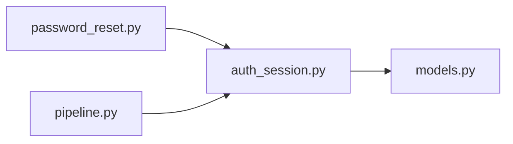

# auth_session.py

저장소 경로 `backend/src/backend/services/auth/auth_session.py` 의 관계 노트입니다. `scripts/codegraph.py` 가 생성하므로 직접 수정하지 않습니다.

## imports

- [[graph/backend/src/backend/db/models|models.py]]

## imported by

- [[graph/backend/src/backend/services/auth/password_reset|password_reset.py]]
- [[graph/backend/src/backend/services/auth/pipeline|pipeline.py]]

## 함수와 호출

- `hash_token`
- `_delete_dead_sessions`
- `create_session`: `backend.db.models`
- `resolve_session`
- `revoke_session`
- `revoke_member_sessions`
