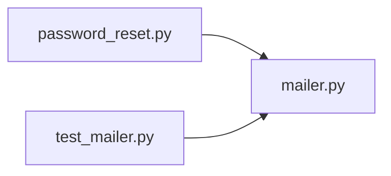

# mailer.py

저장소 경로 `backend/src/backend/services/auth/mailer.py` 의 관계 노트입니다. `scripts/codegraph.py` 가 생성하므로 직접 수정하지 않습니다.

## imports

- 없음

## imported by

- [[graph/backend/src/backend/services/auth/password_reset|password_reset.py]]
- [[graph/backend/tests/unit/test_mailer|test_mailer.py]]

## 함수와 호출

- `_log_body`
- `_deliver`
- `send_mail`
