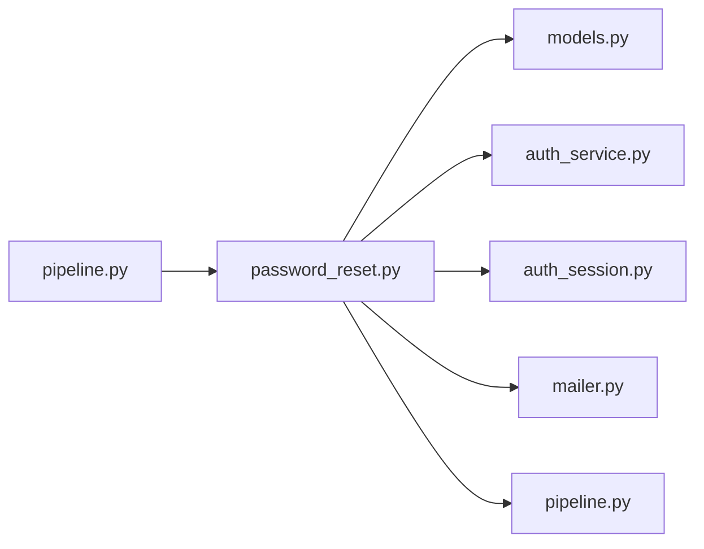

# password_reset.py

저장소 경로 `backend/src/backend/services/auth/password_reset.py` 의 관계 노트입니다. `scripts/codegraph.py` 가 생성하므로 직접 수정하지 않습니다.

## imports

- [[graph/backend/src/backend/db/models|models.py]]
- [[graph/backend/src/backend/services/auth/auth_service|auth_service.py]]
- [[graph/backend/src/backend/services/auth/auth_session|auth_session.py]]
- [[graph/backend/src/backend/services/auth/mailer|mailer.py]]
- [[graph/backend/src/backend/services/validation/pipeline|pipeline.py]]

## imported by

- [[graph/backend/src/backend/services/auth/pipeline|pipeline.py]]

## 함수와 호출

- `_find_account`
- `_reset_link`
- `issue_reset_token`: `backend.db.models`, `backend.services.auth.auth_session`
- `_consume_token`: `backend.services.auth.auth_session`
- `request_password_reset`: `backend.services.auth.mailer`
- `reset_password`: `backend.services.auth.auth_service`, `backend.services.auth.auth_session`, `backend.services.validation.pipeline`
- `send_id_reminder`: `backend.services.auth.mailer`
