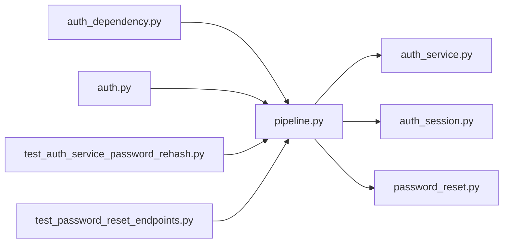

# pipeline.py

저장소 경로 `backend/src/backend/services/auth/pipeline.py` 의 관계 노트입니다. `scripts/codegraph.py` 가 생성하므로 직접 수정하지 않습니다.

## imports

- [[graph/backend/src/backend/services/auth/auth_service|auth_service.py]]
- [[graph/backend/src/backend/services/auth/auth_session|auth_session.py]]
- [[graph/backend/src/backend/services/auth/password_reset|password_reset.py]]

## imported by

- [[graph/backend/src/backend/api/auth_dependency|auth_dependency.py]]
- [[graph/backend/src/backend/api/routers/auth|auth.py]]
- [[graph/backend/tests/integration/db/test_auth_service_password_rehash|test_auth_service_password_rehash.py]]
- [[graph/backend/tests/integration/db/test_password_reset_endpoints|test_password_reset_endpoints.py]]
