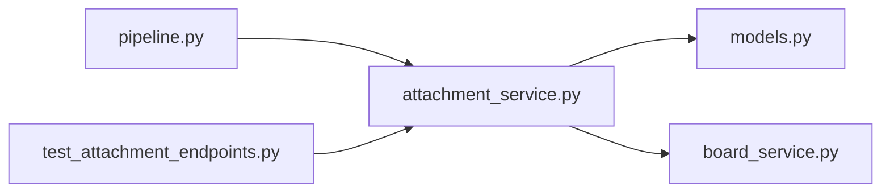

# attachment_service.py

저장소 경로 `backend/src/backend/services/board/attachment_service.py` 의 관계 노트입니다. `scripts/codegraph.py` 가 생성하므로 직접 수정하지 않습니다.

## imports

- [[graph/backend/src/backend/db/models|models.py]]
- [[graph/backend/src/backend/services/board/board_service|board_service.py]]

## imported by

- [[graph/backend/src/backend/services/board/pipeline|pipeline.py]]
- [[graph/backend/tests/integration/db/test_attachment_endpoints|test_attachment_endpoints.py]]

## 함수와 호출

- `storage_root`
- `display_name`
- `_allowed_extension`
- `stored_path`
- `_used_bytes`
- `write_stream`
- `save_attachment`: `backend.db.models`, `backend.services.board.board_service`
- `attachments_of_post`
- `list_attachments`: `backend.services.board.board_service`
- `_get_or_raise`
- `attachment_for_download`: `backend.services.board.board_service`
- `attachment_for_inline`
- `delete_attachment`: `backend.services.board.board_service`
- `remove_post_files`
