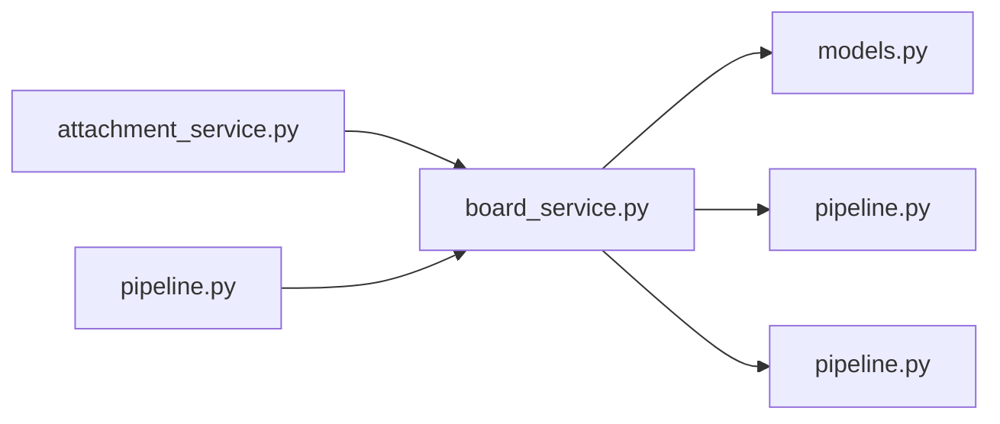

# board_service.py

저장소 경로 `backend/src/backend/services/board/board_service.py` 의 관계 노트입니다. `scripts/codegraph.py` 가 생성하므로 직접 수정하지 않습니다.

## imports

- [[graph/backend/src/backend/db/models|models.py]]
- [[graph/backend/src/backend/services/permission/pipeline|pipeline.py]]
- [[graph/backend/src/backend/services/validation/pipeline|pipeline.py]]

## imported by

- [[graph/backend/src/backend/services/board/attachment_service|attachment_service.py]]
- [[graph/backend/src/backend/services/board/pipeline|pipeline.py]]

## 함수와 호출

- `get_team_or_raise`
- `require_team_member`
- `_get_post_or_raise`
- `require_post_readable`
- `_moderates`: `backend.services.permission.pipeline`
- `require_post_author`
- `_comment_counts`
- `_posts_with_author_and_count`
- `list_blinded_posts`
- `set_post_blinded`
- `list_notices`
- `create_notice`: `backend.db.models`, `backend.services.validation.pipeline`
- `create_draft`: `backend.db.models`
- `publish_post`: `backend.services.validation.pipeline`
- `sweep_stale_drafts`
- `list_team_posts`
- `create_team_post`: `backend.db.models`, `backend.services.validation.pipeline`
- `get_post_with_comments`
- `update_post`: `backend.services.validation.pipeline`
- `require_comment_author`
- `update_comment`: `backend.services.validation.pipeline`
- `delete_comment`
- `create_comment`: `backend.db.models`, `backend.services.validation.pipeline`
