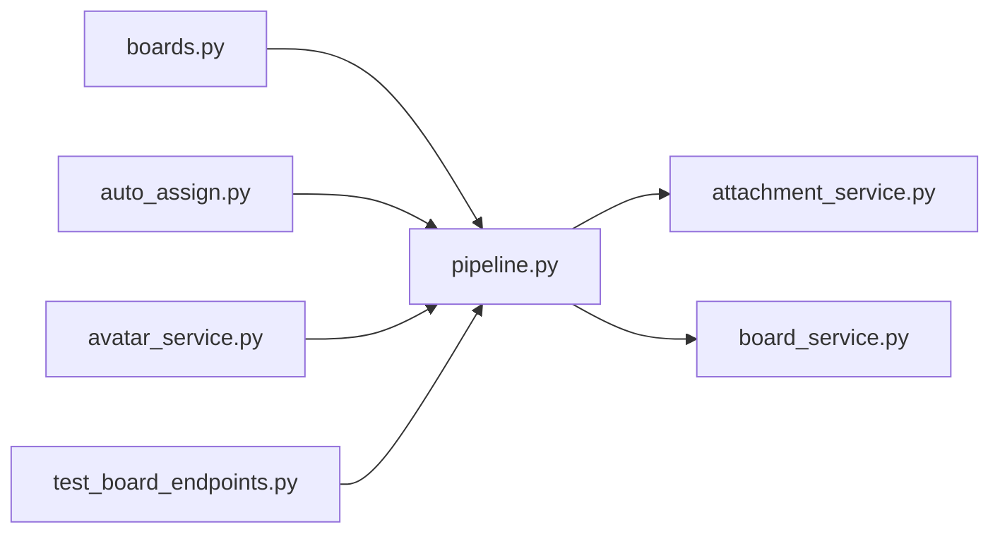

# pipeline.py

저장소 경로 `backend/src/backend/services/board/pipeline.py` 의 관계 노트입니다. `scripts/codegraph.py` 가 생성하므로 직접 수정하지 않습니다.

## imports

- [[graph/backend/src/backend/services/board/attachment_service|attachment_service.py]]
- [[graph/backend/src/backend/services/board/board_service|board_service.py]]

## imported by

- [[graph/backend/src/backend/api/routers/boards|boards.py]]
- [[graph/backend/src/backend/jobs/auto_assign|auto_assign.py]]
- [[graph/backend/src/backend/services/roster/avatar_service|avatar_service.py]]
- [[graph/backend/tests/integration/db/test_board_endpoints|test_board_endpoints.py]]
