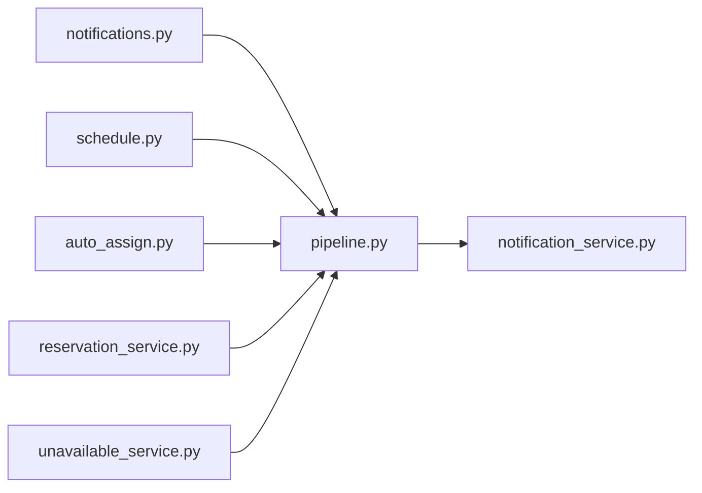

# pipeline.py

저장소 경로 `backend/src/backend/services/notification/pipeline.py` 의 관계 노트입니다. `scripts/codegraph.py` 가 생성하므로 직접 수정하지 않습니다.

## imports

- [[graph/backend/src/backend/services/notification/notification_service|notification_service.py]]

## imported by

- [[graph/backend/src/backend/api/routers/notifications|notifications.py]]
- [[graph/backend/src/backend/api/routers/schedule|schedule.py]]
- [[graph/backend/src/backend/jobs/auto_assign|auto_assign.py]]
- [[graph/backend/src/backend/services/reservation/reservation_service|reservation_service.py]]
- [[graph/backend/src/backend/services/unavailable/unavailable_service|unavailable_service.py]]
