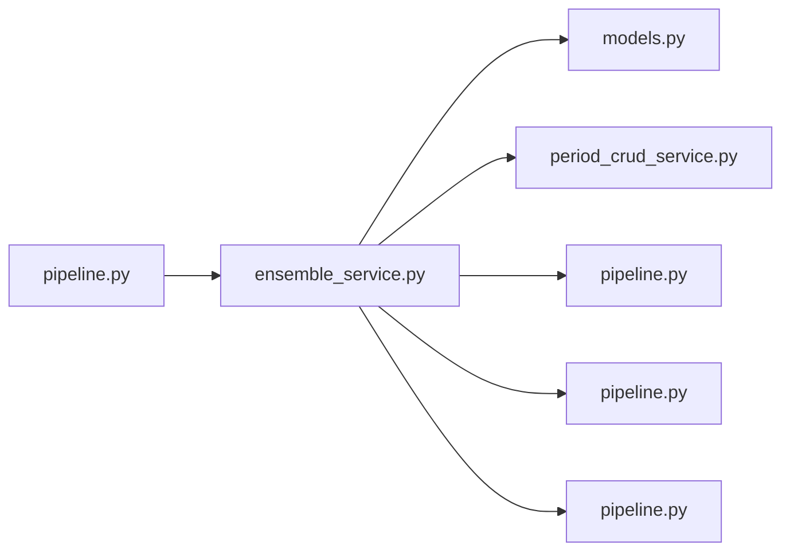

# ensemble_service.py

저장소 경로 `backend/src/backend/services/period/ensemble_service.py` 의 관계 노트입니다. `scripts/codegraph.py` 가 생성하므로 직접 수정하지 않습니다.

## imports

- [[graph/backend/src/backend/db/models|models.py]]
- [[graph/backend/src/backend/services/period/period_crud_service|period_crud_service.py]]
- [[graph/backend/src/backend/services/room/pipeline|pipeline.py]]
- [[graph/backend/src/backend/services/settings/pipeline|pipeline.py]]
- [[graph/backend/src/backend/services/validation/pipeline|pipeline.py]]

## imported by

- [[graph/backend/src/backend/services/period/pipeline|pipeline.py]]

## 함수와 호출

- `_ensemble_times`: `backend.services.settings.pipeline`, `backend.services.validation.pipeline`
- `set_ensemble`: `backend.services.period.period_crud_service`, `backend.services.room.pipeline`, `backend.services.validation.pipeline`
- `delete_ensemble`: `backend.services.period.period_crud_service`
- `set_ensemble_day`: `backend.services.period.period_crud_service`, `backend.services.room.pipeline`, `backend.services.validation.pipeline`
- `delete_ensemble_day`: `backend.services.period.period_crud_service`, `backend.services.validation.pipeline`
- `days_by_period`
