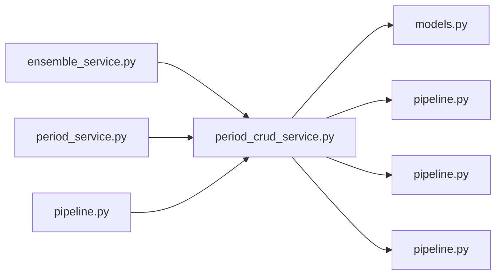

# period_crud_service.py

저장소 경로 `backend/src/backend/services/period/period_crud_service.py` 의 관계 노트입니다. `scripts/codegraph.py` 가 생성하므로 직접 수정하지 않습니다.

## imports

- [[graph/backend/src/backend/db/models|models.py]]
- [[graph/backend/src/backend/db/pipeline|pipeline.py]]
- [[graph/backend/src/backend/services/reservation/pipeline|pipeline.py]]
- [[graph/backend/src/backend/services/validation/pipeline|pipeline.py]]

## imported by

- [[graph/backend/src/backend/services/period/ensemble_service|ensemble_service.py]]
- [[graph/backend/src/backend/services/period/period_service|period_service.py]]
- [[graph/backend/src/backend/services/period/pipeline|pipeline.py]]

## 함수와 호출

- `commit_with_cancellations`: `backend.db.pipeline`, `backend.services.reservation.pipeline`
- `_pair_columns`: `backend.services.validation.pipeline`
- `list_periods`
- `create_period`: `backend.db.models`, `backend.services.validation.pipeline`
- `_validated_changes`: `backend.services.validation.pipeline`
- `update_period`
- `delete_period`
- `get_period_or_raise`
- `list_schedule`
- `list_backup_round`
