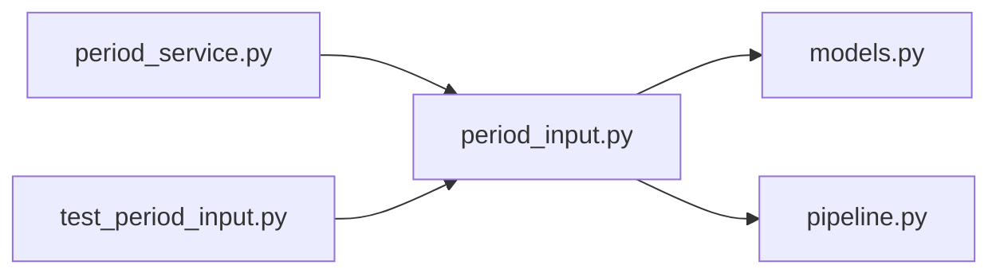

# period_input.py

저장소 경로 `backend/src/backend/services/period/period_input.py` 의 관계 노트입니다. `scripts/codegraph.py` 가 생성하므로 직접 수정하지 않습니다.

## imports

- [[graph/backend/src/backend/db/models|models.py]]
- [[graph/backend/src/backend/scheduling/pipeline|pipeline.py]]

## imported by

- [[graph/backend/src/backend/services/period/period_service|period_service.py]]
- [[graph/backend/tests/unit/test_period_input|test_period_input.py]]

## 함수와 호출

- `dates_in_period`
- `expand_unavailable`: `backend.scheduling.pipeline`
- `_occurrences`
- `build_engine_rooms`: `backend.scheduling.pipeline`
- `capped_sessions_per_team`
- `auto_sessions_per_team`: `backend.scheduling.pipeline`
- `build_engine_teams`: `backend.scheduling.pipeline`
