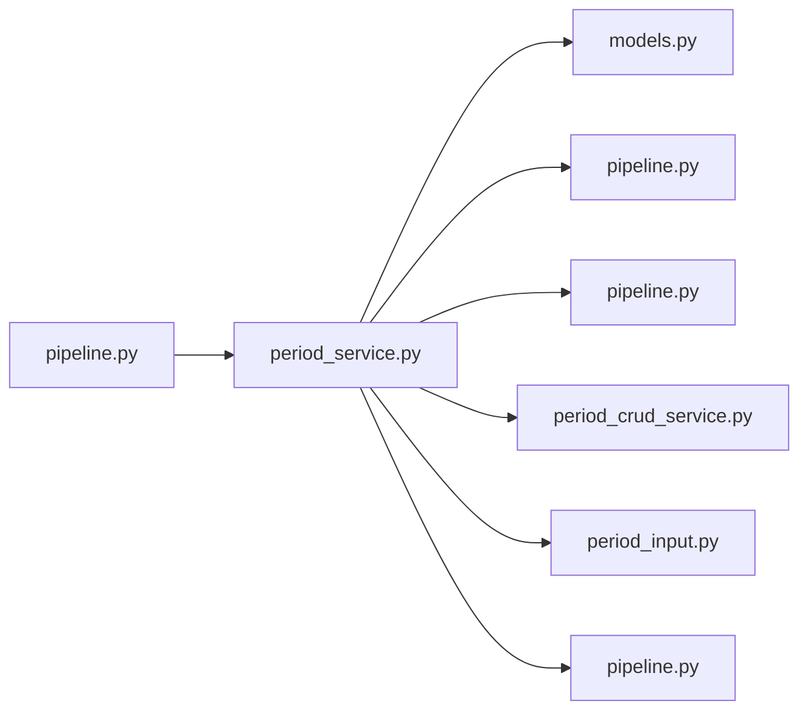

# period_service.py

저장소 경로 `backend/src/backend/services/period/period_service.py` 의 관계 노트입니다. `scripts/codegraph.py` 가 생성하므로 직접 수정하지 않습니다.

## imports

- [[graph/backend/src/backend/db/models|models.py]]
- [[graph/backend/src/backend/db/pipeline|pipeline.py]]
- [[graph/backend/src/backend/scheduling/pipeline|pipeline.py]]
- [[graph/backend/src/backend/services/period/period_crud_service|period_crud_service.py]]
- [[graph/backend/src/backend/services/period/period_input|period_input.py]]
- [[graph/backend/src/backend/services/settings/pipeline|pipeline.py]]

## imported by

- [[graph/backend/src/backend/services/period/pipeline|pipeline.py]]

## 함수와 호출

- `assign_period`: `backend.db.pipeline`, `backend.scheduling.pipeline`, `backend.services.period.period_input`
- `_check_request`: `backend.services.period.period_crud_service`
- `_engine_limits`: `backend.services.period.period_input`, `backend.services.settings.pipeline`
- `practice_window`: `backend.services.period.period_input`
- `period_days`: `backend.services.period.period_input`
- `_load_rooms`
- `_load_team_names`
- `_load_members`
- `_without_member`
- `open_slots_in_period`: `backend.scheduling.pipeline`, `backend.services.period.period_input`, `backend.services.settings.pipeline`
- `_load_unavailable`: `backend.services.period.period_input`
- `_assignment_rows`
