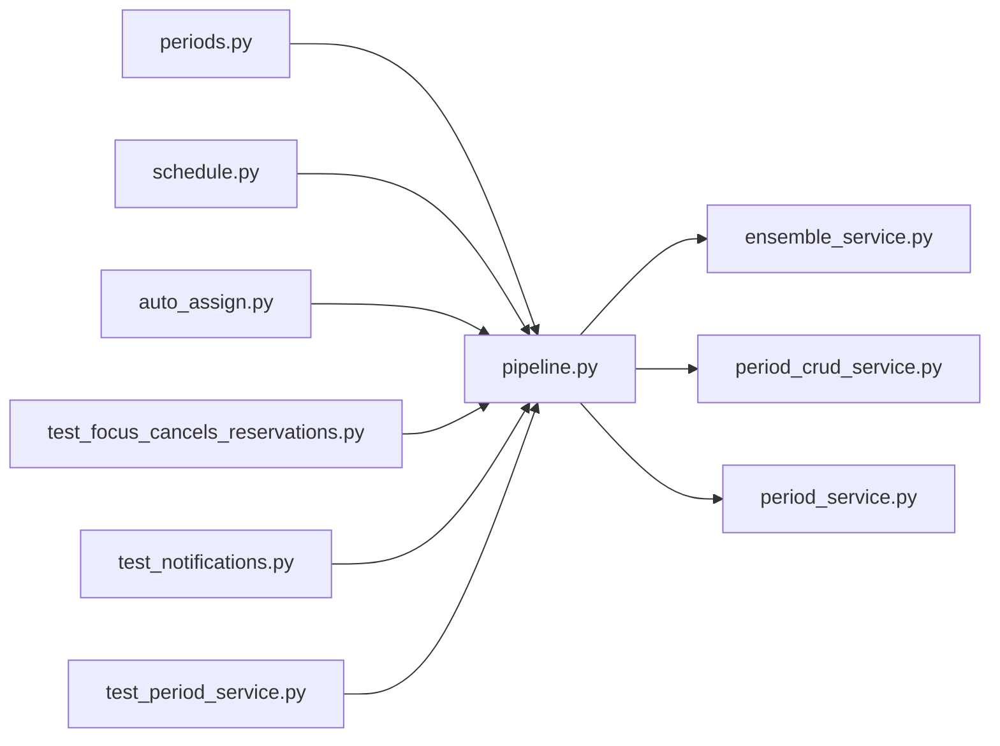

# pipeline.py

저장소 경로 `backend/src/backend/services/period/pipeline.py` 의 관계 노트입니다. `scripts/codegraph.py` 가 생성하므로 직접 수정하지 않습니다.

## imports

- [[graph/backend/src/backend/services/period/ensemble_service|ensemble_service.py]]
- [[graph/backend/src/backend/services/period/period_crud_service|period_crud_service.py]]
- [[graph/backend/src/backend/services/period/period_service|period_service.py]]

## imported by

- [[graph/backend/src/backend/api/routers/periods|periods.py]]
- [[graph/backend/src/backend/api/routers/schedule|schedule.py]]
- [[graph/backend/src/backend/jobs/auto_assign|auto_assign.py]]
- [[graph/backend/tests/integration/db/test_focus_cancels_reservations|test_focus_cancels_reservations.py]]
- [[graph/backend/tests/integration/db/test_notifications|test_notifications.py]]
- [[graph/backend/tests/integration/db/test_period_service|test_period_service.py]]
