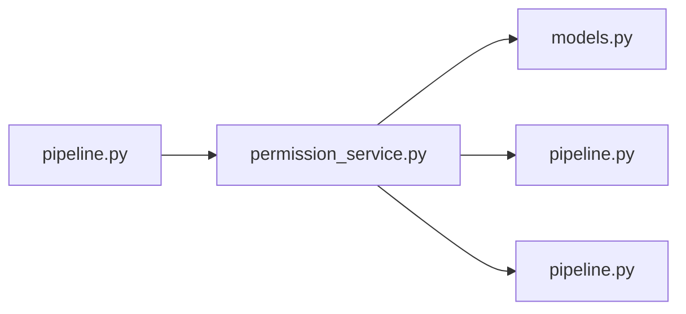

# permission_service.py

저장소 경로 `backend/src/backend/services/permission/permission_service.py` 의 관계 노트입니다. `scripts/codegraph.py` 가 생성하므로 직접 수정하지 않습니다.

## imports

- [[graph/backend/src/backend/db/models|models.py]]
- [[graph/backend/src/backend/db/pipeline|pipeline.py]]
- [[graph/backend/src/backend/services/validation/pipeline|pipeline.py]]

## imported by

- [[graph/backend/src/backend/services/permission/pipeline|pipeline.py]]

## 함수와 호출

- `_clean_permissions`
- `_get_set_or_raise`
- `account_permission_set_names`
- `_is_full`
- `_full_set_ids`
- `_require_another_full_set`
- `require_another_full_set_holder`
- `account_permissions`
- `list_permission_sets`
- `set_holders`
- `create_permission_set`: `backend.db.models`, `backend.db.pipeline`, `backend.services.validation.pipeline`
- `update_permission_set`: `backend.db.pipeline`, `backend.services.validation.pipeline`
- `delete_permission_set`
- `_find_grant`
- `grant_permission_set`: `backend.db.models`
- `revoke_permission_set`
- `grant_full_permissions`: `backend.db.models`
