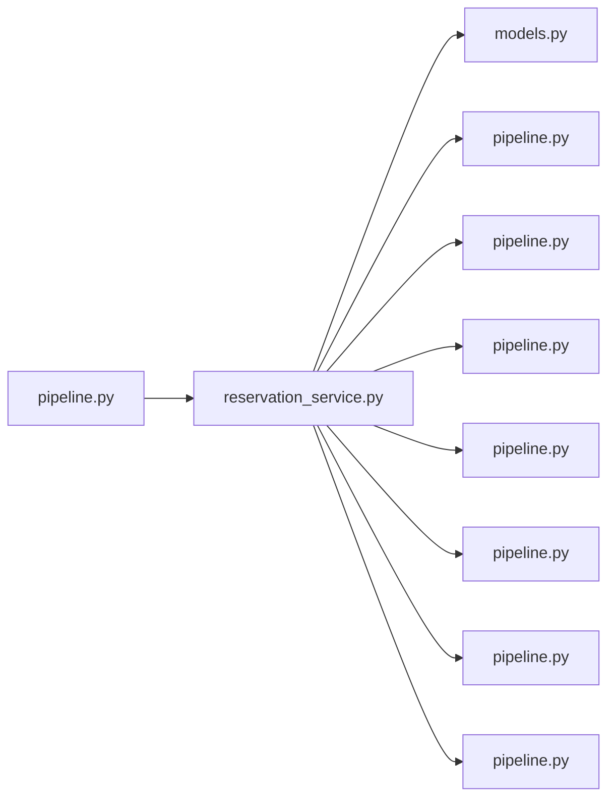

# reservation_service.py

저장소 경로 `backend/src/backend/services/reservation/reservation_service.py` 의 관계 노트입니다. `scripts/codegraph.py` 가 생성하므로 직접 수정하지 않습니다.

## imports

- [[graph/backend/src/backend/db/models|models.py]]
- [[graph/backend/src/backend/db/pipeline|pipeline.py]]
- [[graph/backend/src/backend/services/notification/pipeline|pipeline.py]]
- [[graph/backend/src/backend/services/permission/pipeline|pipeline.py]]
- [[graph/backend/src/backend/services/room/pipeline|pipeline.py]]
- [[graph/backend/src/backend/services/roster/pipeline|pipeline.py]]
- [[graph/backend/src/backend/services/settings/pipeline|pipeline.py]]
- [[graph/backend/src/backend/services/validation/pipeline|pipeline.py]]

## imported by

- [[graph/backend/src/backend/services/reservation/pipeline|pipeline.py]]

## 함수와 호출

- `_require_not_in_focused_period`
- `cancel_reservations_in_focus`: `backend.db.models`
- `focus_refusal`
- `_require_not_started`
- `_planned_row`: `backend.db.models`, `backend.services.room.pipeline`, `backend.services.roster.pipeline`, `backend.services.settings.pipeline`, `backend.services.validation.pipeline`
- `create_reservation`: `backend.db.pipeline`
- `list_reservations`: `backend.services.room.pipeline`
- `list_my_reservations`
- `_get_own_reservation`: `backend.services.permission.pipeline`
- `cancel_reservation`
- `reject_reservation`: `backend.services.notification.pipeline`, `backend.services.permission.pipeline`, `backend.services.validation.pipeline`
- `update_reservation`: `backend.db.models`, `backend.db.pipeline`, `backend.services.room.pipeline`, `backend.services.settings.pipeline`, `backend.services.validation.pipeline`
