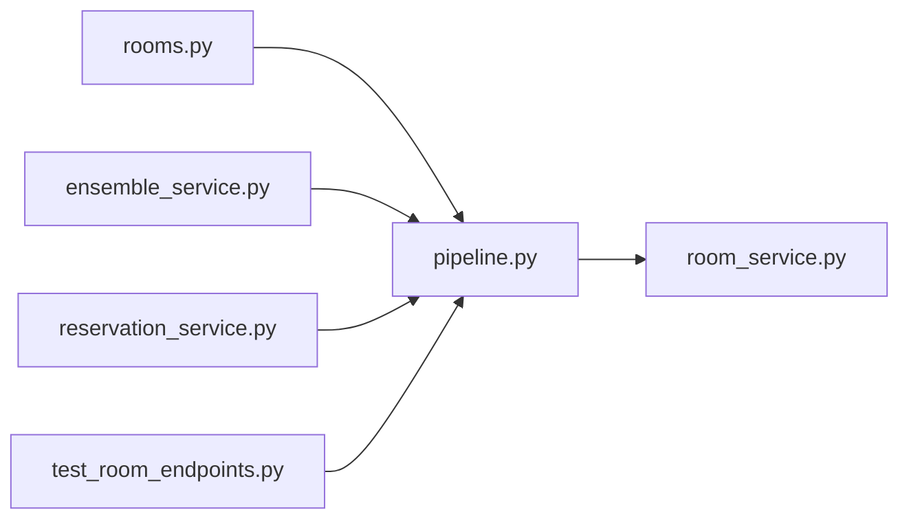

# pipeline.py

저장소 경로 `backend/src/backend/services/room/pipeline.py` 의 관계 노트입니다. `scripts/codegraph.py` 가 생성하므로 직접 수정하지 않습니다.

## imports

- [[graph/backend/src/backend/services/room/room_service|room_service.py]]

## imported by

- [[graph/backend/src/backend/api/routers/rooms|rooms.py]]
- [[graph/backend/src/backend/services/period/ensemble_service|ensemble_service.py]]
- [[graph/backend/src/backend/services/reservation/reservation_service|reservation_service.py]]
- [[graph/backend/tests/integration/db/test_room_endpoints|test_room_endpoints.py]]
