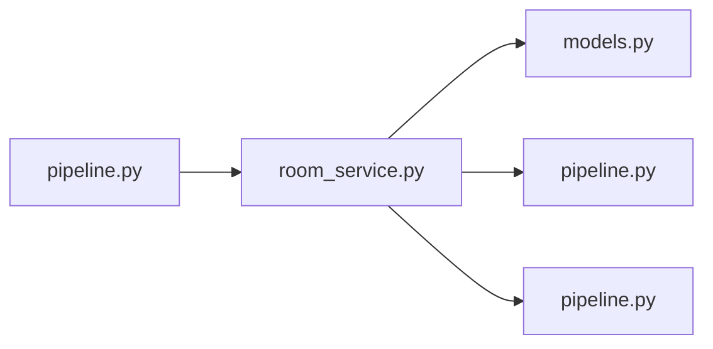

# room_service.py

저장소 경로 `backend/src/backend/services/room/room_service.py` 의 관계 노트입니다. `scripts/codegraph.py` 가 생성하므로 직접 수정하지 않습니다.

## imports

- [[graph/backend/src/backend/db/models|models.py]]
- [[graph/backend/src/backend/db/pipeline|pipeline.py]]
- [[graph/backend/src/backend/services/validation/pipeline|pipeline.py]]

## imported by

- [[graph/backend/src/backend/services/room/pipeline|pipeline.py]]

## 함수와 호출

- `list_rooms`
- `create_room`: `backend.db.models`, `backend.db.pipeline`, `backend.services.validation.pipeline`
- `update_room`: `backend.db.pipeline`, `backend.services.validation.pipeline`
- `_parse_room_clock`: `backend.services.validation.pipeline`
- `delete_room`: `backend.db.pipeline`
- `get_room_or_raise`
