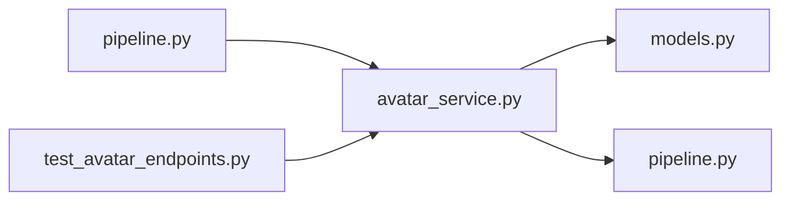

# avatar_service.py

저장소 경로 `backend/src/backend/services/roster/avatar_service.py` 의 관계 노트입니다. `scripts/codegraph.py` 가 생성하므로 직접 수정하지 않습니다.

## imports

- [[graph/backend/src/backend/db/models|models.py]]
- [[graph/backend/src/backend/services/board/pipeline|pipeline.py]]

## imported by

- [[graph/backend/src/backend/services/roster/pipeline|pipeline.py]]
- [[graph/backend/tests/integration/db/test_avatar_endpoints|test_avatar_endpoints.py]]

## 함수와 호출

- `_image_extension`
- `avatar_path`: `backend.services.board.pipeline`
- `save_avatar`: `backend.services.board.pipeline`
- `delete_avatar`: `backend.services.board.pipeline`
