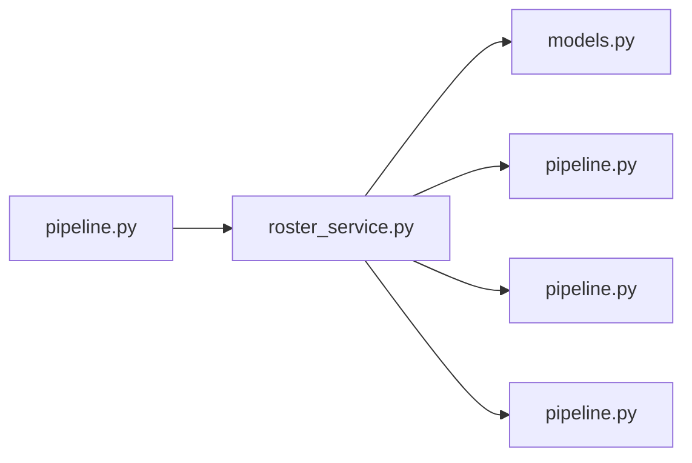

# roster_service.py

저장소 경로 `backend/src/backend/services/roster/roster_service.py` 의 관계 노트입니다. `scripts/codegraph.py` 가 생성하므로 직접 수정하지 않습니다.

## imports

- [[graph/backend/src/backend/db/models|models.py]]
- [[graph/backend/src/backend/db/pipeline|pipeline.py]]
- [[graph/backend/src/backend/services/permission/pipeline|pipeline.py]]
- [[graph/backend/src/backend/services/validation/pipeline|pipeline.py]]

## imported by

- [[graph/backend/src/backend/services/roster/pipeline|pipeline.py]]

## 함수와 호출

- `list_teams`
- `list_slots`
- `list_my_teams`
- `list_members`
- `search_members`
- `expel_member`: `backend.services.permission.pipeline`
- `require_slot_counts`
- `get_team_or_raise`
- `require_team_member`
- `_get_slot_or_raise`
- `_require_known_color`
- `create_team`: `backend.db.models`, `backend.db.pipeline`, `backend.services.validation.pipeline`
- `update_team`: `backend.db.pipeline`, `backend.services.validation.pipeline`
- `replace_slots`: `backend.db.models`, `backend.db.pipeline`
- `delete_team`: `backend.db.pipeline`
- `assign_slot`: `backend.db.pipeline`
- `assign_slot_members`: `backend.db.pipeline`
- `_require_may_unseat`
- `_require_may_seat`
- `clear_slot`: `backend.db.pipeline`
