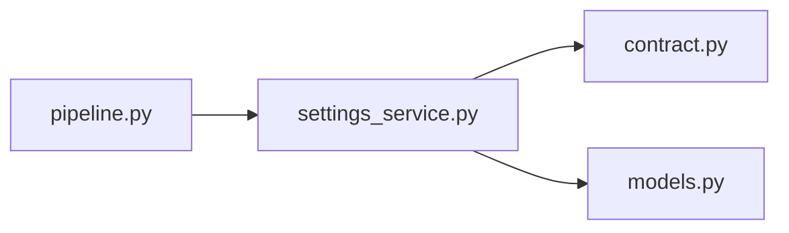

# settings_service.py

저장소 경로 `backend/src/backend/services/settings/settings_service.py` 의 관계 노트입니다. `scripts/codegraph.py` 가 생성하므로 직접 수정하지 않습니다.

## imports

- [[graph/backend/src/backend/contract|contract.py]]
- [[graph/backend/src/backend/db/models|models.py]]

## imported by

- [[graph/backend/src/backend/services/settings/pipeline|pipeline.py]]

## 함수와 호출

- `_row`
- `slot_minutes`
- `session_minutes`
- `daily_max_hours`
- `set_settings`
- `_check_fits`
