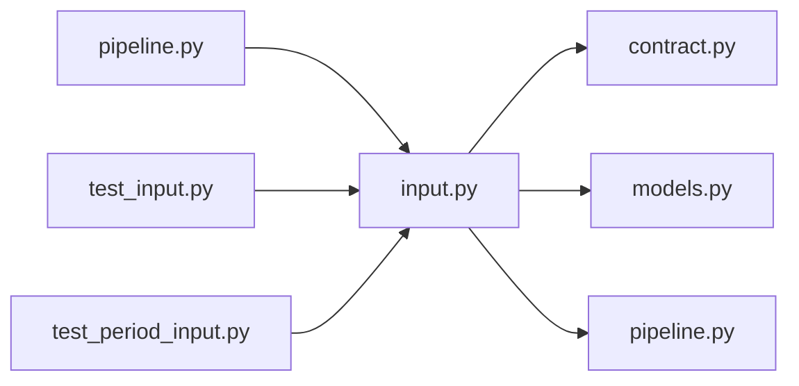

# input.py

저장소 경로 `backend/src/backend/services/validation/input.py` 의 관계 노트입니다. `scripts/codegraph.py` 가 생성하므로 직접 수정하지 않습니다.

## imports

- [[graph/backend/src/backend/contract|contract.py]]
- [[graph/backend/src/backend/db/models|models.py]]
- [[graph/backend/src/backend/scheduling/pipeline|pipeline.py]]

## imported by

- [[graph/backend/src/backend/services/validation/pipeline|pipeline.py]]
- [[graph/backend/tests/unit/test_input|test_input.py]]
- [[graph/backend/tests/unit/test_period_input|test_period_input.py]]

## 함수와 호출

- `require_non_empty`
- `require_email`
- `require_reject_reason`
- `require_login_id`
- `require_person_name`
- `require_department`
- `require_student_no`
- `require_password`
- `require_cohort`
- `require_valid_kind`
- `parse_clock`
- `format_clock`
- `parse_calendar_date`
- `format_calendar_date`
- `format_created_at`
- `require_on_the_hour`
- `require_closes_after_opens`
- `require_ends_not_before_starts`
- `require_valid_slot_bounds`: `backend.scheduling.pipeline`
- `require_same_day`
- `require_within_room_hours`
- `require_repeat_weekdays`
- `require_repeat_end`
