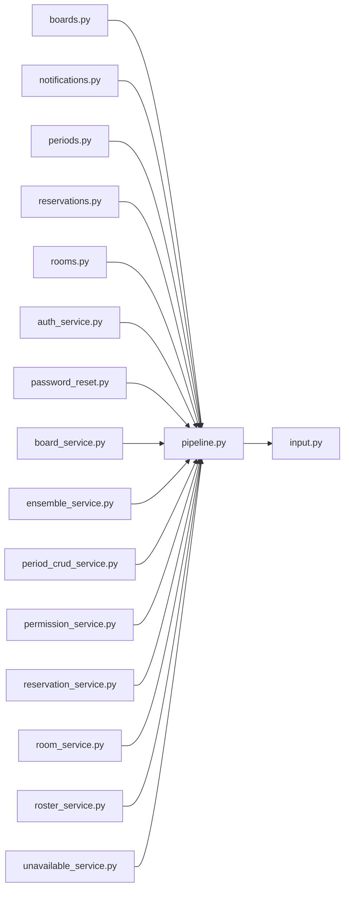

# pipeline.py

저장소 경로 `backend/src/backend/services/validation/pipeline.py` 의 관계 노트입니다. `scripts/codegraph.py` 가 생성하므로 직접 수정하지 않습니다.

## imports

- [[graph/backend/src/backend/services/validation/input|input.py]]

## imported by

- [[graph/backend/src/backend/api/routers/boards|boards.py]]
- [[graph/backend/src/backend/api/routers/notifications|notifications.py]]
- [[graph/backend/src/backend/api/routers/periods|periods.py]]
- [[graph/backend/src/backend/api/routers/reservations|reservations.py]]
- [[graph/backend/src/backend/api/routers/rooms|rooms.py]]
- [[graph/backend/src/backend/services/auth/auth_service|auth_service.py]]
- [[graph/backend/src/backend/services/auth/password_reset|password_reset.py]]
- [[graph/backend/src/backend/services/board/board_service|board_service.py]]
- [[graph/backend/src/backend/services/period/ensemble_service|ensemble_service.py]]
- [[graph/backend/src/backend/services/period/period_crud_service|period_crud_service.py]]
- [[graph/backend/src/backend/services/permission/permission_service|permission_service.py]]
- [[graph/backend/src/backend/services/reservation/reservation_service|reservation_service.py]]
- [[graph/backend/src/backend/services/room/room_service|room_service.py]]
- [[graph/backend/src/backend/services/roster/roster_service|roster_service.py]]
- [[graph/backend/src/backend/services/unavailable/unavailable_service|unavailable_service.py]]
