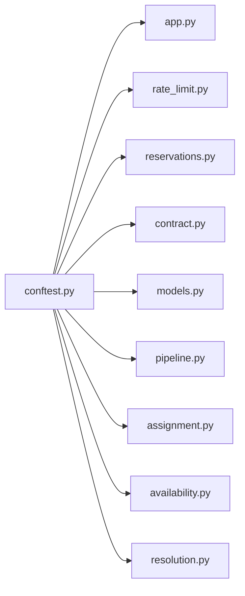

# conftest.py

저장소 경로 `backend/tests/conftest.py` 의 관계 노트입니다. `scripts/codegraph.py` 가 생성하므로 직접 수정하지 않습니다.

## imports

- [[graph/backend/src/backend/api/app|app.py]]
- [[graph/backend/src/backend/api/rate_limit|rate_limit.py]]
- [[graph/backend/src/backend/api/routers/reservations|reservations.py]]
- [[graph/backend/src/backend/contract|contract.py]]
- [[graph/backend/src/backend/db/models|models.py]]
- [[graph/backend/src/backend/db/pipeline|pipeline.py]]
- [[graph/backend/src/backend/scheduling/assignment|assignment.py]]
- [[graph/backend/src/backend/scheduling/availability|availability.py]]
- [[graph/backend/src/backend/scheduling/resolution|resolution.py]]

## imported by

- 없음

## 함수와 호출

- `assign`: `backend.scheduling.assignment`
- `resolve`: `backend.scheduling.resolution`
- `seat`: `backend.db.models`
- `test_engine`
- `db_session`
- `api_client`
- `admin_code`
- `account`
- `poll_job`
- `pytest_collection_modifyitems`
- `_forget_rate_limits`: `backend.api.rate_limit`
