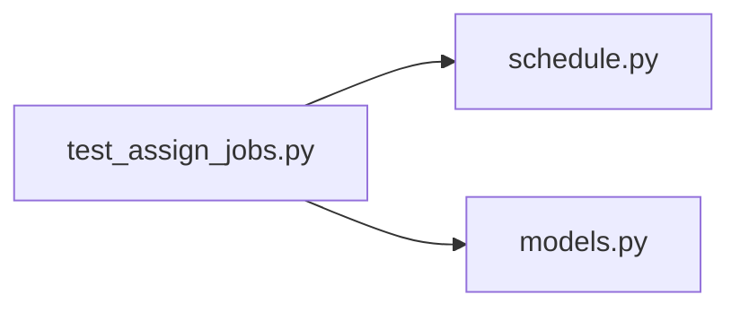

# test_assign_jobs.py

저장소 경로 `backend/tests/integration/db/test_assign_jobs.py` 의 관계 노트입니다. `scripts/codegraph.py` 가 생성하므로 직접 수정하지 않습니다.

## imports

- [[graph/backend/src/backend/api/routers/schedule|schedule.py]]
- [[graph/backend/src/backend/db/models|models.py]]

## imported by

- 없음

## 함수와 호출

- `head_login`
- `_period`: `backend.db.models`
- `_team_with_member`: `backend.db.models`
- `test_assign_returns_202_immediately_with_a_queued_or_running_job`: `backend.db.models`
- `test_polling_the_job_eventually_reports_the_saved_result`: `backend.db.models`
- `test_a_rejected_assignment_becomes_a_failed_job_with_the_reason`: `backend.db.models`
- `test_assign_on_an_unknown_period_is_rejected_immediately`
- `test_unknown_job_id_is_rejected`
- `test_health_responds_while_an_assignment_job_is_running`: `backend.db.models`
- `test_job_lookup_without_login_is_rejected`
- `test_job_lookup_needs_assign_read`
