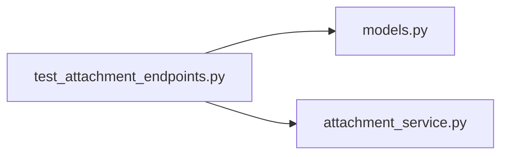

# test_attachment_endpoints.py

저장소 경로 `backend/tests/integration/db/test_attachment_endpoints.py` 의 관계 노트입니다. `scripts/codegraph.py` 가 생성하므로 직접 수정하지 않습니다.

## imports

- [[graph/backend/src/backend/db/models|models.py]]
- [[graph/backend/src/backend/services/board/attachment_service|attachment_service.py]]

## imported by

- 없음

## 함수와 호출

- `storage_dir`
- `_stored_files`
- `_make_team`
- `_seat`
- `_notice`
- `test_attachment_is_uploaded_listed_and_downloaded`
- `test_post_detail_carries_attachments`
- `test_disallowed_extension_is_rejected`
- `test_a_reader_can_attach_to_someone_elses_notice`
- `test_non_member_cannot_attach_to_a_team_board_post`
- `test_non_member_cannot_download_team_board_attachment`
- `test_teammate_who_is_not_the_author_can_read_and_download`
- `test_download_requires_login`
- `test_deleting_the_post_removes_the_stored_file`
- `test_author_deletes_one_attachment`
- `test_traversal_filename_never_escapes_the_storage_root`
- `test_a_moderator_cannot_attach_to_someone_elses_post`
- `test_uploads_are_rejected_once_the_post_exceeds_the_total_size`
- `test_one_file_larger_than_the_total_size_is_rejected`
- `test_deleting_an_attachment_frees_the_total_size`
- `test_a_concurrent_upload_cannot_pass_the_total_size`: `backend.db.models`, `backend.services.board.attachment_service._used_bytes`, `backend.services.board.attachment_service.save_attachment`
- `test_inline_serves_a_pdf_with_its_own_type`
- `test_inline_refuses_a_format_that_must_not_render`
- `test_inline_requires_read_permission`
