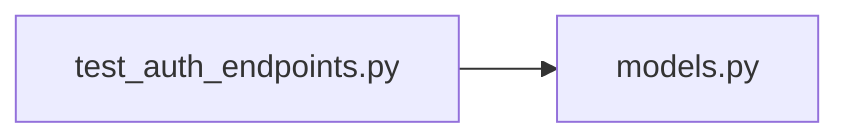

# test_auth_endpoints.py

저장소 경로 `backend/tests/integration/db/test_auth_endpoints.py` 의 관계 노트입니다. `scripts/codegraph.py` 가 생성하므로 직접 수정하지 않습니다.

## imports

- [[graph/backend/src/backend/db/models|models.py]]

## imported by

- 없음

## 함수와 호출

- `_signup`
- `_set_cookie_headers`
- `_session_row`
- `test_signup_creates_an_account_and_does_not_return_a_token`
- `test_signup_sets_an_httponly_session_cookie_and_a_readable_signed_in_cookie`
- `test_the_first_account_is_a_plain_member_without_the_code`
- `test_the_admin_code_makes_a_head_manager`
- `test_a_later_account_becomes_a_member`
- `test_signup_allows_a_duplicate_name`
- `test_signup_refuses_the_same_person_twice`
- `test_signup_rejects_a_duplicate_email`
- `test_signup_rejects_a_malformed_email`
- `test_signup_rejects_a_short_password`
- `test_signup_rejects_a_cohort_out_of_range`
- `test_signup_rejects_a_cohort_below_one`
- `test_signup_stores_a_hashed_password_not_the_original`
- `test_login_sets_a_session_cookie_and_does_not_return_a_token`
- `test_login_rejects_an_unknown_email_without_revealing_that`
- `test_me_returns_the_signed_in_account`
- `test_me_rejects_a_missing_session_cookie`
- `test_me_rejects_an_unknown_session_cookie`
- `test_me_rejects_a_revoked_session`
- `test_me_rejects_an_expired_session`
- `test_logout_revokes_the_session_so_it_no_longer_works`
- `test_logout_clears_both_cookies`
- `test_logout_succeeds_even_when_not_signed_in`
- `_session_count`
- `test_login_removes_that_accounts_expired_session_row`
- `test_login_removes_only_the_dead_rows_of_that_account`
- `_session_max_age`
- `test_login_without_keep_lasts_only_for_the_browser_session`
- `test_login_with_keep_lasts_far_longer`
- `test_keeping_the_login_also_stretches_the_row_on_the_server`
- `test_leaving_requires_login`
- `test_leaving_removes_the_account_and_everything_it_left`
- `test_editing_my_profile_requires_login`
- `test_i_can_change_my_name_and_cohort`
- `test_editing_my_profile_into_someone_else_says_who_it_collides_with`
- `test_editing_my_profile_rejects_an_empty_name`
- `test_changing_my_password_needs_the_current_one`
- `test_changing_my_password_lets_me_log_in_with_the_new_one`
- `test_changing_my_password_rejects_a_weak_one`
- `test_signup_rejects_a_student_no_that_is_not_eight_digits`
- `_signup_with`
- `test_the_admin_code_grants_every_permission`
- `test_signing_up_without_the_code_gets_no_permission`
- `test_a_wrong_admin_code_signs_up_as_a_plain_member`
- `test_the_code_is_refused_when_the_environment_has_none`
- `test_signup_rejects_an_invalid_login_id`
- `test_signup_rejects_a_duplicate_login_id`
- `test_login_works_with_the_login_id_and_normalizes_uppercase_input`
- `test_login_with_the_email_instead_of_the_login_id_fails`
