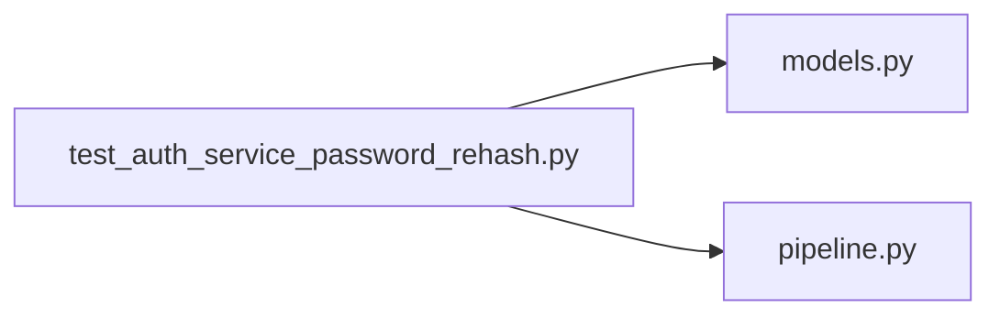

# test_auth_service_password_rehash.py

저장소 경로 `backend/tests/integration/db/test_auth_service_password_rehash.py` 의 관계 노트입니다. `scripts/codegraph.py` 가 생성하므로 직접 수정하지 않습니다.

## imports

- [[graph/backend/src/backend/db/models|models.py]]
- [[graph/backend/src/backend/services/auth/pipeline|pipeline.py]]

## imported by

- 없음

## 함수와 호출

- `_weak_hash`
- `_add_member`: `backend.db.models`
- `test_login_upgrades_a_weak_hash_on_success`: `backend.services.auth.pipeline`
- `test_login_keeps_a_new_format_hash_unchanged`: `backend.services.auth.pipeline`
- `test_login_rejects_a_wrong_password_for_a_weak_hash`: `backend.services.auth.pipeline`
