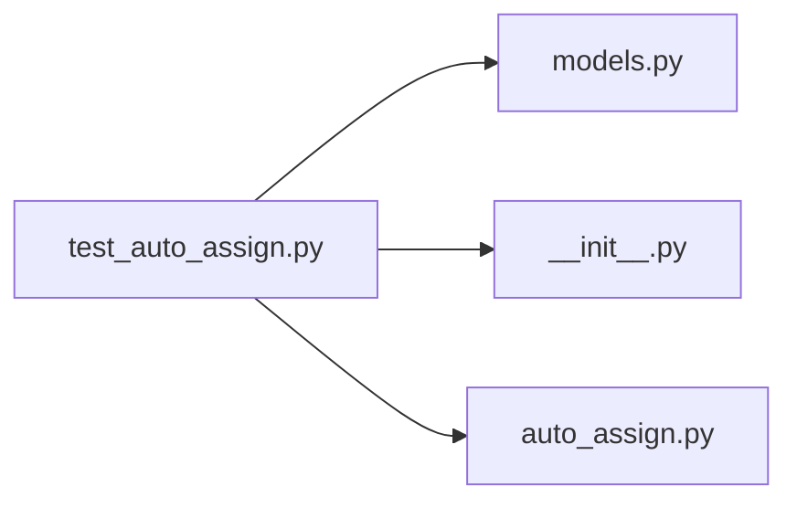

# test_auto_assign.py

저장소 경로 `backend/tests/integration/db/test_auto_assign.py` 의 관계 노트입니다. `scripts/codegraph.py` 가 생성하므로 직접 수정하지 않습니다.

## imports

- [[graph/backend/src/backend/db/models|models.py]]
- [[graph/backend/src/backend/jobs/__init__|__init__.py]]
- [[graph/backend/src/backend/jobs/auto_assign|auto_assign.py]]

## imported by

- 없음

## 함수와 호출

- `_at`
- `_period`: `backend.db.models`
- `_team_with_member`: `backend.db.models`
- `_room`: `backend.db.models`
- `_runs`
- `_assignments`
- `_count_assign_calls`
- `test_runs_the_slot_whose_time_has_passed`: `backend.jobs.auto_assign.run_due_assignments`
- `test_does_not_run_before_the_time`: `backend.jobs.auto_assign.run_due_assignments`
- `test_an_everyday_period_does_not_run_on_an_ensemble_day`: `backend.jobs.auto_assign.run_due_assignments`
- `test_does_not_run_a_slot_that_already_ran`: `backend.db.models`, `backend.jobs.auto_assign.run_due_assignments`
- `test_runs_once_when_both_slots_of_today_are_overdue`: `backend.jobs.auto_assign.run_due_assignments`
- `test_does_not_run_a_slot_missed_yesterday`: `backend.jobs.auto_assign.run_due_assignments`
- `test_skips_periods_that_do_not_contain_today`: `backend.jobs.auto_assign.run_due_assignments`
- `test_a_failing_period_leaves_no_run_record`: `backend.jobs.auto_assign.run_due_assignments`
- `test_an_everyday_period_keeps_running_after_its_end_date`: `backend.jobs.auto_assign.run_due_assignments`
