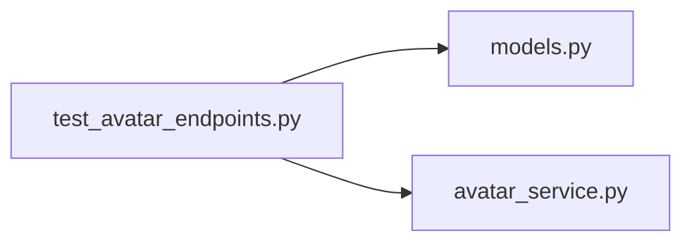

# test_avatar_endpoints.py

저장소 경로 `backend/tests/integration/db/test_avatar_endpoints.py` 의 관계 노트입니다. `scripts/codegraph.py` 가 생성하므로 직접 수정하지 않습니다.

## imports

- [[graph/backend/src/backend/db/models|models.py]]
- [[graph/backend/src/backend/services/roster/avatar_service|avatar_service.py]]

## imported by

- 없음

## 함수와 호출

- `storage_dir`
- `_upload`
- `_stored_files`
- `test_uploading_a_photo_makes_it_readable_by_account_number`
- `test_an_account_without_a_photo_answers_not_found`
- `test_a_second_upload_replaces_the_first_and_leaves_one_file`
- `test_deleting_removes_the_file_and_the_column`
- `test_only_image_files_are_accepted`
- `test_a_photo_over_the_limit_is_refused_and_nothing_is_left_on_disk`
- `test_another_members_photo_is_readable_by_anyone_signed_in`
- `test_a_visitor_without_a_session_cannot_see_a_photo`
- `test_my_account_carries_the_stored_photo_name`
- `test_an_upload_during_another_session_does_not_leave_an_orphan_file`: `backend.services.roster.avatar_service.save_avatar`
