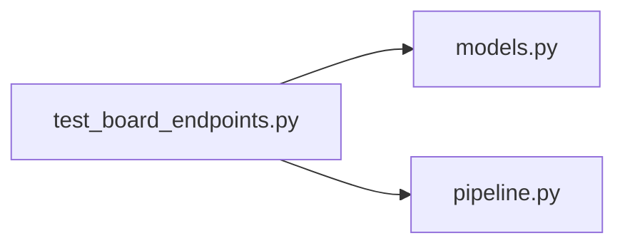

# test_board_endpoints.py

저장소 경로 `backend/tests/integration/db/test_board_endpoints.py` 의 관계 노트입니다. `scripts/codegraph.py` 가 생성하므로 직접 수정하지 않습니다.

## imports

- [[graph/backend/src/backend/db/models|models.py]]
- [[graph/backend/src/backend/services/board/pipeline|pipeline.py]]

## imported by

- 없음

## 함수와 호출

- `_team`: `backend.db.models`
- `_member`: `backend.db.models`
- `_join`
- `test_notice_is_created_and_listed`
- `test_notices_are_listed_newest_first`
- `test_notice_creation_rejects_an_empty_title`
- `test_notice_creation_rejects_an_empty_body`
- `test_notice_reading_requires_authentication`
- `test_notice_reading_allows_a_member_without_a_team`
- `test_notice_creation_requires_a_head_manager`
- `test_notice_creation_requires_authentication`
- `test_notice_creation_rejects_a_title_over_the_length_limit`
- `test_notice_creation_rejects_a_body_over_the_length_limit`
- `test_team_post_is_created_by_a_team_member`
- `test_team_post_creation_rejects_a_non_member_author`
- `test_team_post_creation_rejects_an_unknown_team`
- `test_team_posts_are_listed_only_for_that_team`
- `test_team_posts_list_is_empty_for_a_team_with_no_posts`
- `test_team_posts_endpoint_rejects_an_unknown_team`
- `test_team_posts_read_requires_team_membership`
- `test_team_posts_read_requires_authentication`
- `test_post_detail_includes_comments`
- `test_post_detail_rejects_an_unknown_post`
- `test_post_detail_of_a_team_post_requires_membership`
- `test_post_detail_of_a_notice_needs_no_team_membership`
- `test_comment_creation_rejects_an_empty_body`
- `test_comment_creation_rejects_a_non_member_author_on_a_team_post`
- `test_comment_creation_allows_a_team_member_on_a_team_post`
- `test_post_author_is_taken_from_the_token_not_the_request_body`
- `test_comment_creation_rejects_a_body_over_the_length_limit`
- `test_post_title_blank_after_trim_is_rejected_at_the_database_level`: `backend.db.models`
- `test_post_body_blank_after_trim_is_rejected_at_the_database_level`: `backend.db.models`
- `test_comment_body_blank_after_trim_is_rejected_at_the_database_level`: `backend.db.models`
- `test_editing_a_post_requires_authentication`
- `test_only_the_author_can_edit_a_post`
- `test_the_author_can_edit_their_own_post`
- `test_editing_a_post_rejects_an_empty_title`
- `_comment`
- `test_only_the_author_can_edit_a_comment`
- `test_the_author_can_edit_their_own_comment`
- `test_editing_a_comment_rejects_an_empty_body`
- `test_only_the_author_can_delete_a_comment`
- `test_the_author_can_delete_their_own_comment`
- `test_a_blinded_post_disappears_for_its_own_author`
- `test_blinding_needs_the_moderate_permission`
- `test_a_blinded_post_comes_back_when_the_blind_is_lifted`
- `test_only_a_moderator_reads_the_blinded_list`
- `test_the_blinded_list_shows_who_blinded_each_post`
- `test_a_moderator_cannot_edit_someone_elses_post`
- `test_a_moderator_still_deletes_someone_elses_post`
- `test_a_draft_is_created_empty_and_hidden_from_the_list`
- `test_publishing_a_draft_puts_it_in_the_list`
- `test_another_member_cannot_read_my_draft`
- `test_writing_a_notice_draft_needs_the_permission`
- `test_stale_drafts_are_swept_but_fresh_ones_stay`: `backend.services.board.pipeline`
