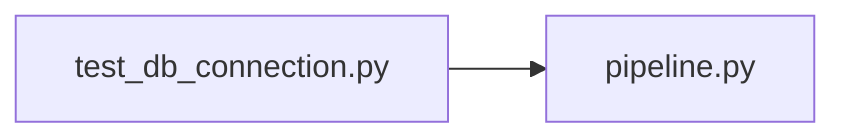

# test_db_connection.py

저장소 경로 `backend/tests/integration/db/test_db_connection.py` 의 관계 노트입니다. `scripts/codegraph.py` 가 생성하므로 직접 수정하지 않습니다.

## imports

- [[graph/backend/src/backend/db/pipeline|pipeline.py]]

## imported by

- 없음

## 함수와 호출

- `test_database_answers_select_one`: `backend.db.pipeline`
