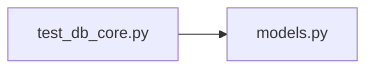

# test_db_core.py

저장소 경로 `backend/tests/integration/db/test_db_core.py` 의 관계 노트입니다. `scripts/codegraph.py` 가 생성하므로 직접 수정하지 않습니다.

## imports

- [[graph/backend/src/backend/db/models|models.py]]

## imported by

- 없음

## 함수와 호출

- `test_two_members_may_share_a_name`: `backend.db.models`
- `test_team_name_must_be_unique`: `backend.db.models`
- `test_same_person_cannot_take_two_slots_of_one_team`: `backend.db.models`
- `test_one_person_may_sit_in_two_teams`: `backend.db.models`
- `test_many_empty_slots_may_share_a_team`: `backend.db.models`
- `test_the_same_place_cannot_exist_twice_in_a_team`: `backend.db.models`
