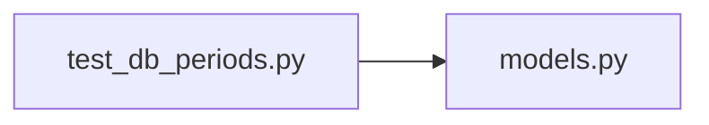

# test_db_periods.py

저장소 경로 `backend/tests/integration/db/test_db_periods.py` 의 관계 노트입니다. `scripts/codegraph.py` 가 생성하므로 직접 수정하지 않습니다.

## imports

- [[graph/backend/src/backend/db/models|models.py]]

## imported by

- 없음

## 함수와 호출

- `_focused_period`: `backend.db.models`
- `test_focused_period_with_two_run_times_round_trips`
- `test_unknown_period_kind_is_rejected`: `backend.db.models`
- `test_same_room_and_start_cannot_be_assigned_twice`: `backend.db.models`
