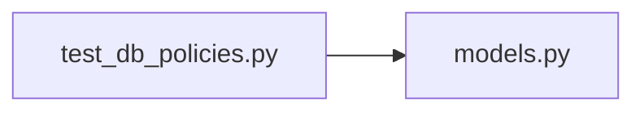

# test_db_policies.py

저장소 경로 `backend/tests/integration/db/test_db_policies.py` 의 관계 노트입니다. `scripts/codegraph.py` 가 생성하므로 직접 수정하지 않습니다.

## imports

- [[graph/backend/src/backend/db/models|models.py]]

## imported by

- 없음

## 함수와 호출

- `test_room_closing_before_opening_is_rejected`: `backend.db.models`
- `test_deleting_a_member_empties_their_slot_but_keeps_it`: `backend.db.models`
- `test_deleting_a_team_removes_its_assignments`: `backend.db.models`
- `test_period_requires_both_run_times`: `backend.db.models`
