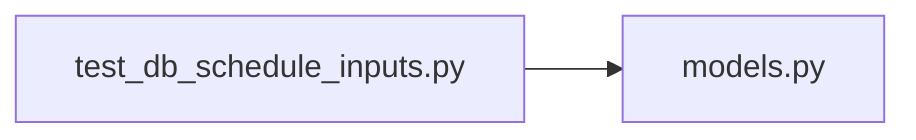

# test_db_schedule_inputs.py

저장소 경로 `backend/tests/integration/db/test_db_schedule_inputs.py` 의 관계 노트입니다. `scripts/codegraph.py` 가 생성하므로 직접 수정하지 않습니다.

## imports

- [[graph/backend/src/backend/db/models|models.py]]

## imported by

- 없음

## 함수와 호출

- `test_weekly_repeating_unavailable_time_round_trips`: `backend.db.models`
- `test_reversed_unavailable_interval_is_rejected`: `backend.db.models`
- `test_room_name_must_be_unique`: `backend.db.models`
- `test_room_hours_off_the_on_the_hour_are_rejected`: `backend.db.models`
