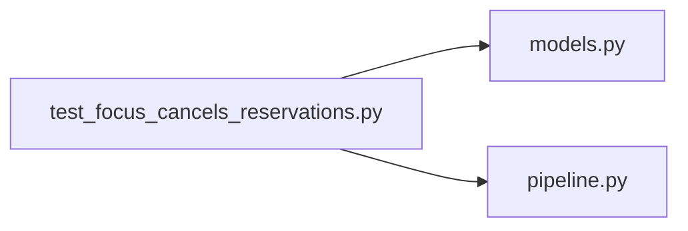

# test_focus_cancels_reservations.py

저장소 경로 `backend/tests/integration/db/test_focus_cancels_reservations.py` 의 관계 노트입니다. `scripts/codegraph.py` 가 생성하므로 직접 수정하지 않습니다.

## imports

- [[graph/backend/src/backend/db/models|models.py]]
- [[graph/backend/src/backend/services/period/pipeline|pipeline.py]]

## imported by

- 없음

## 함수와 호출

- `_cancelled`
- `test_creating_a_focused_period_cancels_the_reservations_inside_it`
- `test_widening_a_focused_period_cancels_the_reservations_it_now_covers`
- `_ensemble_setup`: `backend.db.models`
- `_booking`: `backend.db.models`
- `test_removing_the_ensemble_cancels_the_reservations_it_used_to_allow`: `backend.services.period.pipeline`
- `test_removing_a_narrower_day_time_cancels_what_now_overlaps_the_default`: `backend.services.period.pipeline`
- `test_the_period_change_and_the_cancellations_are_saved_in_one_commit`: `backend.services.period.pipeline`
