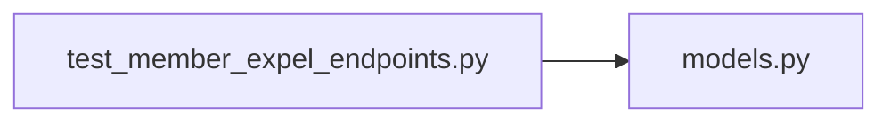

# test_member_expel_endpoints.py

저장소 경로 `backend/tests/integration/db/test_member_expel_endpoints.py` 의 관계 노트입니다. `scripts/codegraph.py` 가 생성하므로 직접 수정하지 않습니다.

## imports

- [[graph/backend/src/backend/db/models|models.py]]

## imported by

- 없음

## 함수와 호출

- `test_expel_requires_the_member_expel_permission`
- `test_expelling_deletes_the_account_and_frees_their_slot`: `backend.db.models`
- `test_nobody_can_expel_themselves`
- `test_expelling_an_unknown_member_is_rejected`
- `_grant_expel_only`
- `test_expelling_the_last_full_set_holder_is_rejected`
- `test_expelling_a_full_set_holder_is_allowed_while_another_remains`
