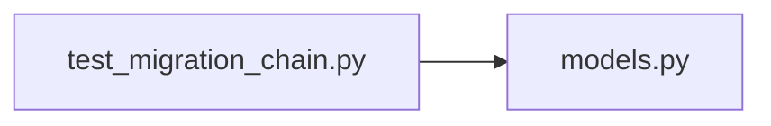

# test_migration_chain.py

저장소 경로 `backend/tests/integration/db/test_migration_chain.py` 의 관계 노트입니다. `scripts/codegraph.py` 가 생성하므로 직접 수정하지 않습니다.

## imports

- [[graph/backend/src/backend/db/models|models.py]]

## imported by

- 없음

## 함수와 호출

- `migration_db`
- `test_the_initial_migration_seeds_the_rows_the_server_requires`
- `test_the_whole_chain_can_be_downgraded_to_base`
- `test_assignment_tables_have_an_index_on_the_period`
