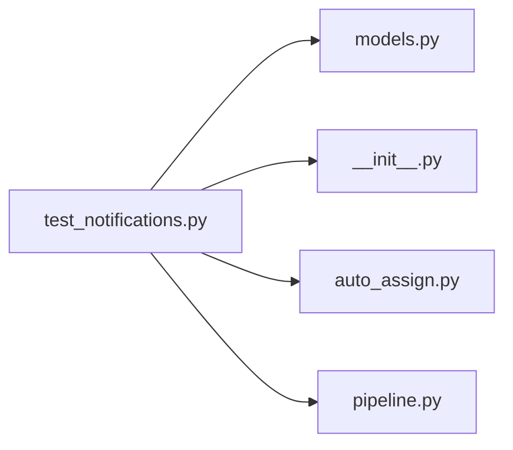

# test_notifications.py

저장소 경로 `backend/tests/integration/db/test_notifications.py` 의 관계 노트입니다. `scripts/codegraph.py` 가 생성하므로 직접 수정하지 않습니다.

## imports

- [[graph/backend/src/backend/db/models|models.py]]
- [[graph/backend/src/backend/jobs/__init__|__init__.py]]
- [[graph/backend/src/backend/jobs/auto_assign|auto_assign.py]]
- [[graph/backend/src/backend/services/period/pipeline|pipeline.py]]

## imported by

- 없음

## 함수와 호출

- `_due_time`
- `_period`: `backend.db.models`
- `_team_with`: `backend.db.models`
- `_room`: `backend.db.models`
- `_notifications`
- `assigned_member`
- `test_auto_assign_leaves_a_notification`: `backend.jobs.auto_assign.run_due_assignments`
- `test_a_member_of_no_assigned_team_gets_nothing`: `backend.jobs.auto_assign.run_due_assignments`
- `test_another_persons_notification_is_not_visible`: `backend.db.models`
- `test_reading_needs_a_login`
- `test_marking_read_deletes_the_notifications`: `backend.jobs.auto_assign.run_due_assignments`
- `test_marking_read_leaves_other_peoples_notifications`: `backend.db.models`, `backend.jobs.auto_assign.run_due_assignments`
- `test_a_person_pressing_recalculate_also_leaves_a_notification`
- `test_rolling_back_leaves_a_notification`: `backend.services.period.pipeline`
