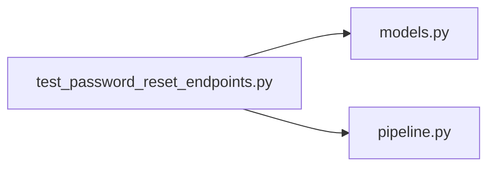

# test_password_reset_endpoints.py

저장소 경로 `backend/tests/integration/db/test_password_reset_endpoints.py` 의 관계 노트입니다. `scripts/codegraph.py` 가 생성하므로 직접 수정하지 않습니다.

## imports

- [[graph/backend/src/backend/db/models|models.py]]
- [[graph/backend/src/backend/services/auth/pipeline|pipeline.py]]

## imported by

- 없음

## 함수와 호출

- `_confirm`
- `test_a_token_changes_the_password_and_the_new_one_logs_in`: `backend.services.auth.pipeline`
- `test_the_same_token_is_refused_the_second_time`: `backend.services.auth.pipeline`
- `test_an_expired_token_is_refused`: `backend.services.auth.pipeline`
- `test_the_row_keeps_a_fingerprint_not_the_token_itself`: `backend.services.auth.pipeline`
- `test_resetting_kills_the_logins_that_were_already_open`: `backend.services.auth.pipeline`
- `test_a_request_for_an_unknown_email_answers_like_a_known_one`
- `test_a_second_request_within_the_interval_does_not_issue_another_token`: `backend.services.auth.pipeline`
- `test_a_new_token_kills_the_one_issued_before_it`: `backend.services.auth.pipeline`
- `test_find_id_answers_the_same_whether_the_account_exists`
- `test_find_id_mails_the_registered_address_only_when_the_pair_matches`
- `_mail_reasons`
- `test_the_log_tells_whether_a_reset_mail_went_out_and_why_not`
- `test_the_log_tells_whether_an_id_reminder_went_out_and_why_not`
