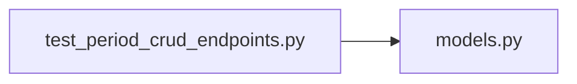

# test_period_crud_endpoints.py

저장소 경로 `backend/tests/integration/db/test_period_crud_endpoints.py` 의 관계 노트입니다. `scripts/codegraph.py` 가 생성하므로 직접 수정하지 않습니다.

## imports

- [[graph/backend/src/backend/db/models|models.py]]

## imported by

- 없음

## 함수와 호출

- `_period`: `backend.db.models`
- `test_periods_are_listed_by_start_date_then_id`
- `test_period_is_created_with_string_dates_and_times`
- `test_period_creation_rejects_an_unknown_kind`
- `test_period_creation_rejects_ends_on_before_starts_on`
- `test_period_is_patched_with_only_the_sent_fields`
- `test_period_is_patched_with_a_new_kind_starts_on_everyday_and_run_times`
- `test_period_patch_rejects_an_unknown_kind`
- `test_period_patch_rejects_ends_on_before_the_kept_starts_on`
- `test_period_patch_of_unknown_id_is_rejected`
- `test_period_patch_can_turn_everyday_back_off`
- `test_period_patch_does_not_leak_a_rejected_kind_change`
- `test_period_is_deleted_and_leaves_the_list`
- `test_period_delete_of_unknown_id_is_rejected`
- `test_period_delete_also_removes_its_assignment_runs`: `backend.db.models`
- `_focused_body`
- `test_focused_period_overlapping_another_focused_period_is_rejected`
- `test_everyday_focused_period_overlaps_every_later_focused_period`
- `test_focused_period_patched_into_an_overlap_is_rejected`
- `test_open_period_may_overlap_a_focused_period`
- `test_period_endpoints_reject_a_request_without_a_login`
- `test_period_writes_are_rejected_for_a_plain_member`
- `test_periods_are_listed_for_a_plain_member`
- `test_a_new_period_has_no_practice_window`
- `test_a_period_is_created_with_a_practice_window`
- `test_only_the_weekday_window_can_be_set`
- `test_a_practice_window_that_ends_before_it_starts_is_refused`
- `test_the_practice_window_is_replaced_by_a_patch`
- `test_a_patch_without_the_practice_window_keeps_it`
- `test_the_practice_window_is_cleared_by_sending_empty_pairs`
- `test_period_name_is_saved_on_create_and_patch_and_defaults_to_empty`
