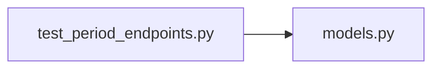

# test_period_endpoints.py

저장소 경로 `backend/tests/integration/db/test_period_endpoints.py` 의 관계 노트입니다. `scripts/codegraph.py` 가 생성하므로 직접 수정하지 않습니다.

## imports

- [[graph/backend/src/backend/db/models|models.py]]

## imported by

- 없음

## 함수와 호출

- `head_login`
- `_period`: `backend.db.models`
- `test_schedule_is_empty_before_any_assignment`
- `test_schedule_lists_current_assignments_with_names`: `backend.db.models`
- `test_schedule_of_unknown_period_is_rejected`
- `test_schedule_excludes_other_periods_assignments`: `backend.db.models`
- `_team_with_member`: `backend.db.models`
- `test_assign_saves_the_schedule_and_reports_it`: `backend.db.models`
- `test_assign_reports_open_slots_with_real_room_names`: `backend.db.models`
- `test_assign_reports_a_coordination_proposal_with_real_names`: `backend.db.models`
- `test_assign_on_an_open_period_is_rejected`: `backend.db.models`
- `test_rollback_restores_the_previous_schedule`: `backend.db.models`
- `test_rollback_without_any_backup_reports_nothing_to_undo`
- `test_rollback_room_time_conflict_with_another_period_is_rejected_not_500`: `backend.db.models`
- `test_schedule_without_login_is_rejected`
- `test_assign_needs_assign_run`
- `test_rollback_needs_rollback`
- `test_schedule_reports_the_slots_left_open_by_the_assignment`: `backend.db.models`
- `test_backups_list_each_round_newest_first`: `backend.db.models`
- `test_backup_round_shows_the_schedule_of_that_round`: `backend.db.models`
- `test_backup_round_that_never_happened_is_rejected`
- `test_backup_round_needs_rollback`
- `test_backups_of_unknown_period_are_rejected`
- `test_backups_need_rollback`
- `_blocked_team`: `backend.db.models`
- `test_confirming_a_proposal_saves_the_schedule_without_that_member`: `backend.db.models`
- `test_confirming_someone_outside_the_roster_fails_the_job`: `backend.db.models`
- `test_confirming_a_proposal_needs_proposal_confirm`
- `test_assign_gives_a_team_one_uninterrupted_session_per_turn`: `backend.db.models`
