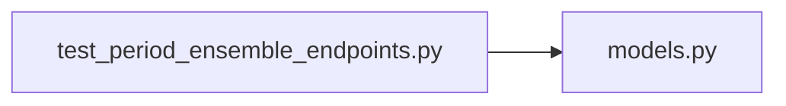

# test_period_ensemble_endpoints.py

저장소 경로 `backend/tests/integration/db/test_period_ensemble_endpoints.py` 의 관계 노트입니다. `scripts/codegraph.py` 가 생성하므로 직접 수정하지 않습니다.

## imports

- [[graph/backend/src/backend/db/models|models.py]]

## imported by

- 없음

## 함수와 호출

- `_room`: `backend.db.models`
- `_period`: `backend.db.models`
- `_body`
- `test_ensemble_is_saved_and_listed_with_the_period`
- `test_period_without_ensemble_lists_null`
- `test_ensemble_rejects_invalid_values`
- `test_ensemble_is_rejected_on_an_open_period`
- `test_everyday_period_accepts_an_ensemble_after_its_stored_end_date`
- `test_period_patch_that_leaves_the_ensemble_outside_is_rejected`
- `test_ensemble_day_time_is_saved_replaced_and_deleted`
- `test_ensemble_day_outside_the_range_is_rejected`
- `test_ensemble_day_is_rejected_without_an_ensemble`
- `test_narrowing_the_ensemble_drops_day_times_outside_the_new_range`
- `test_ensemble_delete_clears_the_setting_and_its_days`
- `test_partially_filled_ensemble_is_rejected_by_the_database`
- `test_ensemble_writes_reject_a_request_without_a_login`
- `test_ensemble_writes_are_rejected_for_a_plain_member`
