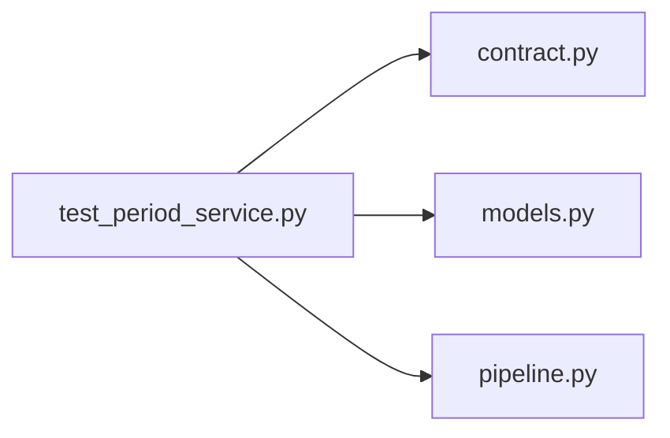

# test_period_service.py

저장소 경로 `backend/tests/integration/db/test_period_service.py` 의 관계 노트입니다. `scripts/codegraph.py` 가 생성하므로 직접 수정하지 않습니다.

## imports

- [[graph/backend/src/backend/contract|contract.py]]
- [[graph/backend/src/backend/db/models|models.py]]
- [[graph/backend/src/backend/services/period/pipeline|pipeline.py]]

## imported by

- 없음

## 함수와 호출

- `_period`: `backend.db.models`
- `_team_with_member`: `backend.db.models`
- `_room`: `backend.db.models`
- `test_successful_assignment_is_saved_as_the_current_schedule`: `backend.services.period.pipeline`
- `test_successful_assignment_round_trips_rooms_teams_and_times`: `backend.services.period.pipeline`
- `test_failed_assignment_saves_nothing_and_names_who_to_exclude`: `backend.db.models`, `backend.services.period.pipeline`
- `test_open_period_is_rejected`: `backend.services.period.pipeline`
- `test_unknown_team_is_rejected`: `backend.services.period.pipeline`
- `test_unknown_room_is_rejected`: `backend.services.period.pipeline`
- `test_reassignment_archives_the_previous_schedule`: `backend.services.period.pipeline`
- `test_failed_reassignment_preserves_the_current_schedule`: `backend.db.models`, `backend.services.period.pipeline`
- `test_unknown_period_is_rejected`: `backend.services.period.pipeline`
- `test_team_without_members_is_rejected`: `backend.db.models`, `backend.services.period.pipeline`
- `test_overlapping_period_room_conflict_is_rejected_not_500`: `backend.services.period.pipeline`
- `test_duplicate_team_id_is_rejected`: `backend.services.period.pipeline`
- `test_duplicate_room_id_is_rejected`: `backend.services.period.pipeline`
- `test_two_week_schedule_for_four_teams_finishes`: `backend.db.models`, `backend.services.period.pipeline`
- `test_unavailable_time_on_the_last_day_of_the_period_blocks_assignment`: `backend.db.models`, `backend.services.period.pipeline`
- `test_multiple_unavailable_times_for_the_same_person_all_block_assignment`: `backend.db.models`, `backend.services.period.pipeline`
- `test_excluding_the_proposed_member_makes_the_assignment_savable`: `backend.db.models`, `backend.services.period.pipeline`
- `test_excluding_someone_outside_the_roster_is_rejected`: `backend.services.period.pipeline`
- `test_open_slots_come_from_the_saved_schedule_without_recomputing`: `backend.services.period.pipeline`
- `test_open_slots_are_empty_when_nothing_is_assigned`: `backend.services.period.pipeline`
- `test_an_everyday_period_assigns_only_the_day_of_the_run`: `backend.services.period.pipeline`
- `test_ensemble_days_are_left_out_of_team_assignment`: `backend.services.period.pipeline`
