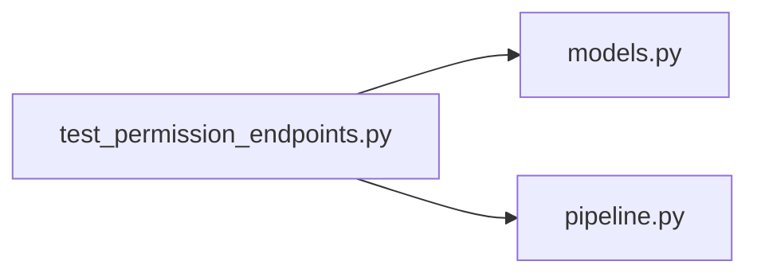

# test_permission_endpoints.py

저장소 경로 `backend/tests/integration/db/test_permission_endpoints.py` 의 관계 노트입니다. `scripts/codegraph.py` 가 생성하므로 직접 수정하지 않습니다.

## imports

- [[graph/backend/src/backend/db/models|models.py]]
- [[graph/backend/src/backend/services/permission/pipeline|pipeline.py]]

## imported by

- 없음

## 함수와 호출

- `_make_set`
- `_my_permissions`
- `test_the_first_account_gets_every_permission`
- `test_a_later_account_gets_no_permission`
- `test_two_sets_give_their_union`
- `test_a_missing_permission_closes_the_gate`
- `test_revoking_a_set_takes_its_permissions_back`
- `test_permission_grant_holder_changes_their_own_set`
- `test_permission_grant_holder_drops_their_own_set`
- `test_without_permission_grant_nobody_touches_permissions`
- `test_deleting_a_set_takes_its_permissions_back`
- `test_a_duplicate_set_name_is_refused`
- `test_an_unknown_permission_is_refused`
- `test_the_listing_shows_who_holds_each_set`
- `_set_ids`
- `test_the_last_full_set_cannot_be_deleted`
- `test_the_last_full_set_cannot_lose_an_item`
- `test_a_second_full_set_frees_the_first`
- `test_revoking_someone_elses_last_full_set_is_rejected`
- `test_revoking_a_full_set_is_allowed_while_another_holder_remains`
- `test_me_lists_the_names_of_my_permission_sets`
- `test_two_concurrent_deletes_keep_one_full_set`: `backend.db.models`, `backend.services.permission.pipeline`
