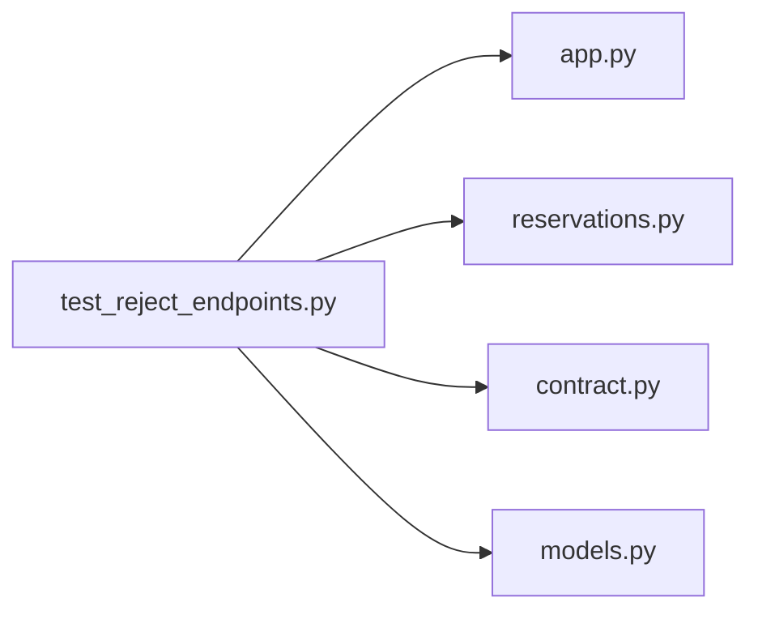

# test_reject_endpoints.py

저장소 경로 `backend/tests/integration/db/test_reject_endpoints.py` 의 관계 노트입니다. `scripts/codegraph.py` 가 생성하므로 직접 수정하지 않습니다.

## imports

- [[graph/backend/src/backend/api/app|app.py]]
- [[graph/backend/src/backend/api/routers/reservations|reservations.py]]
- [[graph/backend/src/backend/contract|contract.py]]
- [[graph/backend/src/backend/db/models|models.py]]

## imported by

- 없음

## 함수와 호출

- `_room`: `backend.db.models`
- `_open_period`: `backend.db.models`
- `_now_is`
- `_reservation`
- `_unavailable`
- `_notifications`
- `test_rejecting_a_reservation_cancels_it_and_tells_the_owner_why`
- `test_rejecting_a_reservation_requires_the_reservation_permission`
- `test_cancelling_someone_elses_reservation_without_a_reason_is_refused`
- `test_rejecting_an_unavailable_time_deletes_it_and_tells_the_owner_why`
- `test_rejecting_an_unavailable_time_requires_the_unavailable_permission`
- `test_rejecting_with_another_members_number_does_not_touch_the_time`
- `test_a_rejection_without_a_reason_is_refused`
- `test_a_rejection_reason_over_the_length_limit_is_refused`
- `test_other_notifications_carry_no_rejection_fields`: `backend.db.models`
