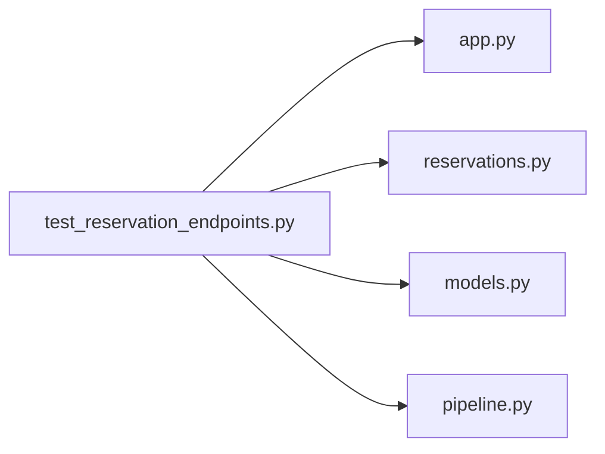

# test_reservation_endpoints.py

저장소 경로 `backend/tests/integration/db/test_reservation_endpoints.py` 의 관계 노트입니다. `scripts/codegraph.py` 가 생성하므로 직접 수정하지 않습니다.

## imports

- [[graph/backend/src/backend/api/app|app.py]]
- [[graph/backend/src/backend/api/routers/reservations|reservations.py]]
- [[graph/backend/src/backend/db/models|models.py]]
- [[graph/backend/src/backend/services/reservation/pipeline|pipeline.py]]

## imported by

- 없음

## 함수와 호출

- `_member`: `backend.db.models`
- `_team`: `backend.db.models`
- `_join`
- `_room`: `backend.db.models`
- `_open_period`: `backend.db.models`
- `_focused_period`: `backend.db.models`
- `test_reservation_endpoints_require_login`
- `test_a_personal_reservation_is_created_as_one_row`
- `test_a_reservation_that_partly_overlaps_another_is_refused`
- `test_a_reservation_may_start_when_another_ends`
- `test_a_reservation_belongs_to_the_cookie_owner_not_the_first_account`
- `test_a_team_reservation_records_the_team`
- `test_a_team_reservation_rejects_someone_outside_the_team`
- `test_reservation_creation_rejects_a_slot_already_taken`
- `test_a_day_with_no_period_at_all_is_open_for_reservation`
- `test_reservation_creation_rejects_a_day_inside_a_focused_period`
- `test_reservation_creation_rejects_a_time_outside_room_hours`
- `test_reservation_creation_rejects_an_unknown_team`
- `test_reservations_in_a_room_are_listed_for_a_date_range`
- `test_anyone_signed_in_can_read_another_members_reservations`
- `test_a_reservation_slot_is_cancelled_by_its_owner`
- `test_a_reservation_slot_cancellation_rejects_someone_else`
- `test_reservation_slot_race_at_commit_time_is_translated_not_500`: `backend.services.reservation.pipeline`
- `test_a_reservation_slot_is_moved_to_a_free_time_by_its_owner`
- `test_moving_a_reservation_slot_onto_a_taken_time_keeps_the_original`
- `test_moving_someone_elses_reservation_slot_is_rejected`
- `test_moving_a_reservation_slot_outside_room_hours_is_rejected`
- `test_a_reservation_slot_can_be_stretched_over_its_own_time`
- `test_moving_a_reservation_keeps_the_old_row_as_cancelled`
- `test_cancelling_keeps_the_row_marked_cancelled_and_frees_the_time`
- `test_a_cancelled_reservation_cannot_be_moved_or_cancelled_again`
- `test_an_everyday_focused_period_blocks_reservations_after_its_end_date`
- `_with_ensemble`
- `_reserve`
- `test_an_ensemble_day_takes_reservations_outside_the_ensemble_room_and_time`
- `test_an_ensemble_day_with_its_own_time_blocks_that_time_instead_of_the_default`: `backend.db.models`
- `test_a_reservation_cannot_be_moved_into_the_ensemble_time`
- `_now_is`
- `test_a_reservation_that_starts_in_the_past_is_refused`
- `test_moving_a_reservation_into_the_past_is_refused`
- `test_my_reservations_list_only_my_reservations_that_have_not_ended`
