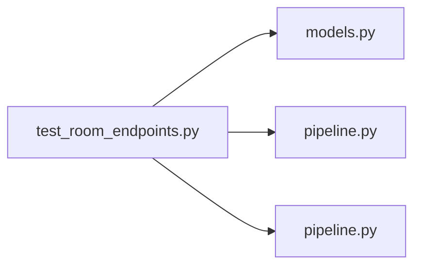

# test_room_endpoints.py

저장소 경로 `backend/tests/integration/db/test_room_endpoints.py` 의 관계 노트입니다. `scripts/codegraph.py` 가 생성하므로 직접 수정하지 않습니다.

## imports

- [[graph/backend/src/backend/db/models|models.py]]
- [[graph/backend/src/backend/db/pipeline|pipeline.py]]
- [[graph/backend/src/backend/services/room/pipeline|pipeline.py]]

## imported by

- 없음

## 함수와 호출

- `_room`: `backend.db.models`
- `test_rooms_are_listed_in_id_order`
- `test_room_is_created_with_hh_mm_times`
- `test_room_creation_rejects_off_grid_minutes`
- `test_room_creation_rejects_closes_at_not_later_than_opens_at`
- `test_room_creation_rejects_a_duplicate_name`
- `test_room_creation_rejects_a_whitespace_only_name`
- `test_room_creation_trims_surrounding_whitespace_from_the_name`
- `test_room_creation_treats_a_whitespace_only_difference_as_a_duplicate`
- `test_room_name_race_at_commit_time_is_translated_not_500`: `backend.db.models`, `backend.db.pipeline`
- `test_room_is_patched_with_only_the_sent_fields`
- `test_room_is_patched_with_a_new_opens_at`
- `test_room_patch_keeping_its_own_name_is_not_rejected`
- `test_room_patch_rejects_a_name_already_used_by_another_room`
- `test_room_patch_rejects_a_whitespace_only_name`
- `test_room_patch_of_unknown_id_is_rejected`
- `test_room_endpoints_reject_a_request_without_a_login`
- `test_room_writes_are_rejected_for_a_plain_member`
- `test_rooms_are_listed_for_a_plain_member`
- `test_room_is_deleted`
- `test_room_delete_of_unknown_id_is_rejected`
- `test_room_delete_is_rejected_for_a_plain_member`
- `test_room_delete_requires_a_login`
- `test_deleting_a_room_removes_its_reservations`
