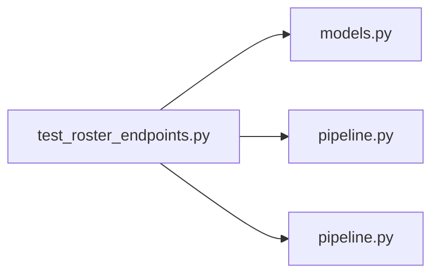

# test_roster_endpoints.py

저장소 경로 `backend/tests/integration/db/test_roster_endpoints.py` 의 관계 노트입니다. `scripts/codegraph.py` 가 생성하므로 직접 수정하지 않습니다.

## imports

- [[graph/backend/src/backend/db/models|models.py]]
- [[graph/backend/src/backend/db/pipeline|pipeline.py]]
- [[graph/backend/src/backend/services/roster/pipeline|pipeline.py]]

## imported by

- 없음

## 함수와 호출

- `_team`: `backend.db.models`
- `_member`: `backend.db.models`
- `_slot_ids`
- `test_teams_list_requires_authentication`
- `test_teams_list_is_empty_when_no_teams`
- `test_teams_carry_both_slot_count_and_filled_count`
- `test_team_slots_read_requires_authentication`
- `test_empty_slots_are_listed_too`
- `test_team_slots_endpoint_rejects_an_unknown_team`
- `test_team_members_lists_only_seated_people`
- `test_member_search_requires_authentication`
- `test_member_search_returns_the_whole_roster_for_an_empty_query`
- `test_member_search_orders_the_whole_roster_by_name`
- `test_member_search_finds_by_partial_name_with_cohort`
- `test_team_creation_requires_authentication`
- `test_team_creation_rejects_a_plain_member`
- `test_team_is_created_with_its_instrument_slots`
- `test_team_creation_rejects_an_unknown_instrument`
- `test_team_creation_rejects_zero_slots`
- `test_team_creation_rejects_more_slots_than_the_engine_takes`
- `test_team_creation_rejects_a_duplicate_name`
- `test_team_creation_trims_surrounding_whitespace`
- `test_team_creation_rejects_a_whitespace_only_name`
- `test_team_name_race_at_commit_time_is_translated_not_500`: `backend.db.models`, `backend.db.pipeline`
- `test_team_is_created_with_the_color_it_was_given`
- `test_team_without_a_color_gets_the_first_free_color`
- `test_team_creation_rejects_a_color_another_team_uses`
- `test_team_creation_rejects_an_unknown_color`
- `test_team_creation_is_rejected_when_every_color_is_taken`
- `test_team_color_is_patched`
- `test_team_patch_requires_authentication`
- `test_team_patch_rejects_a_plain_member`
- `test_team_name_is_patched`
- `test_team_patch_rejects_a_name_already_used_by_another_team`
- `test_team_patch_keeping_its_own_name_is_not_rejected`
- `test_team_patch_of_unknown_id_is_rejected`
- `test_seating_requires_authentication`
- `test_seating_rejects_a_plain_member`
- `test_a_member_is_seated`
- `test_seating_replaces_whoever_sat_there`
- `test_seating_rejects_someone_already_in_another_slot_of_the_team`
- `test_seating_rejects_an_unknown_member`
- `test_seating_rejects_a_slot_from_another_team`
- `test_clearing_a_slot_requires_authentication`
- `test_a_member_can_leave_their_own_slot_without_any_permission`
- `test_a_plain_member_cannot_clear_someone_elses_slot`
- `test_clearing_keeps_the_slot_itself`
- `test_deleting_a_team_requires_authentication`
- `test_deleting_a_team_requires_team_manage`
- `test_deleting_a_team_removes_its_slots_too`
- `test_deleting_a_team_that_is_gone_says_so`
- `test_changing_the_lineup_requires_team_edit`
- `test_adding_a_position_keeps_the_people_already_there`: `backend.db.models`
- `test_removing_a_position_drops_the_last_one`: `backend.db.models`
- `test_changing_the_lineup_can_swap_instruments`: `backend.db.models`
- `test_changing_the_lineup_rejects_an_empty_composition`
- `test_the_member_list_requires_login`
- `test_the_member_list_gives_everyone_with_their_permission_sets`
- `test_the_member_list_pages_from_the_end_of_the_last_one`
- `test_bulk_slot_members_applies_every_entry`: `backend.db.pipeline`
- `test_bulk_slot_members_clears_with_null`: `backend.db.pipeline`
- `test_bulk_slot_members_applies_nothing_when_one_entry_fails`: `backend.db.pipeline`
- `test_bulk_slot_members_requires_member_add_to_seat_someone`: `backend.db.pipeline`
- `test_bulk_slot_members_lets_anyone_leave_their_own_seat`: `backend.db.pipeline`
- `test_bulk_slot_members_can_swap_two_people`: `backend.db.pipeline`
