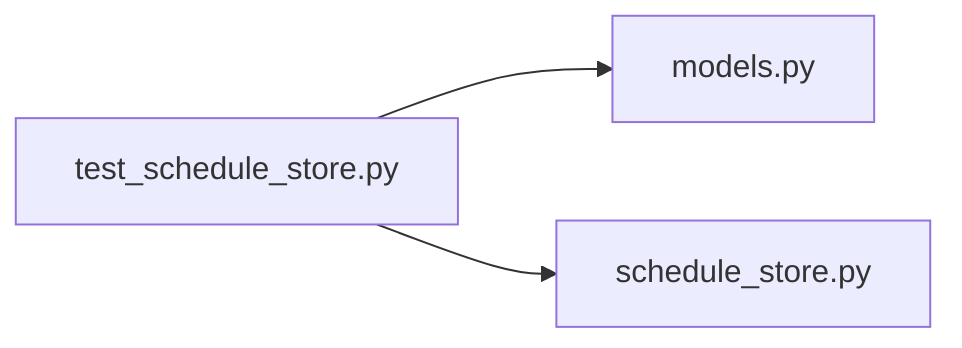

# test_schedule_store.py

저장소 경로 `backend/tests/integration/db/test_schedule_store.py` 의 관계 노트입니다. `scripts/codegraph.py` 가 생성하므로 직접 수정하지 않습니다.

## imports

- [[graph/backend/src/backend/db/models|models.py]]
- [[graph/backend/src/backend/db/schedule_store|schedule_store.py]]

## imported by

- 없음

## 함수와 호출

- `_scaffold`: `backend.db.models`
- `_row`
- `test_assignment_backup_round_trips`: `backend.db.models`
- `test_first_save_writes_current_schedule`: `backend.db.schedule_store`
- `test_second_save_archives_previous`: `backend.db.schedule_store`
- `test_backups_keep_only_two_most_recent`: `backend.db.schedule_store`
- `test_rollback_restores_previous_schedule`: `backend.db.schedule_store`
- `test_rollback_after_third_save_leaves_older_backup_intact`: `backend.db.schedule_store`
- `test_rollback_without_backup_returns_false`: `backend.db.schedule_store`
- `test_two_periods_do_not_interfere`: `backend.db.models`, `backend.db.schedule_store`
- `test_backup_rounds_are_listed_newest_first_with_their_slot_counts`: `backend.db.schedule_store`
- `test_consecutive_slots_become_one_row`: `backend.db.schedule_store`
- `test_a_gap_between_slots_keeps_two_rows`: `backend.db.schedule_store`
- `test_different_teams_are_not_joined`: `backend.db.models`, `backend.db.schedule_store`
- `test_backup_rounds_are_empty_before_any_reassignment`: `backend.db.schedule_store`
